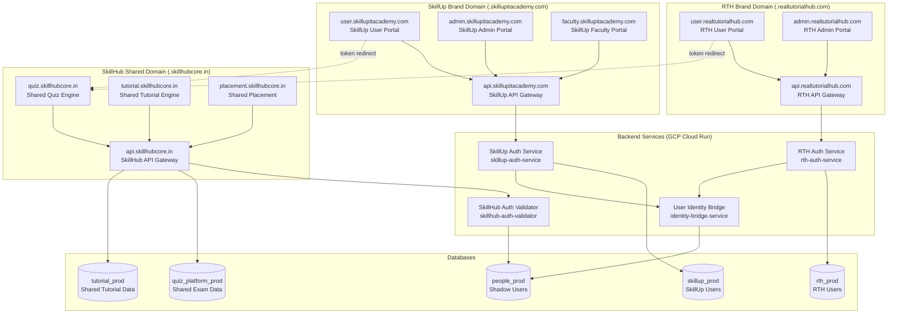
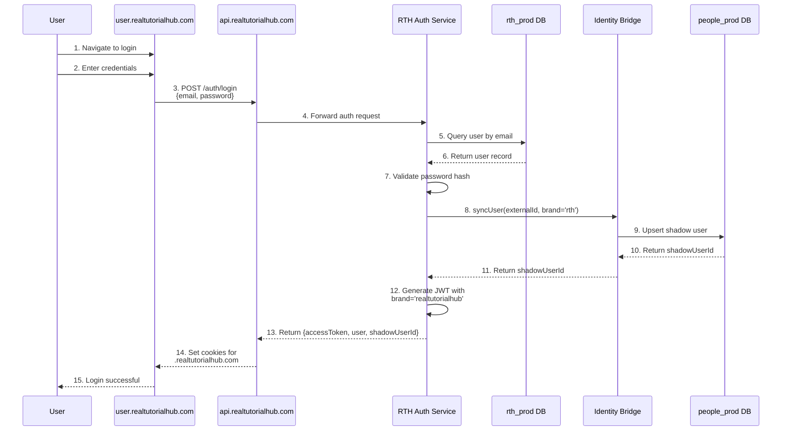
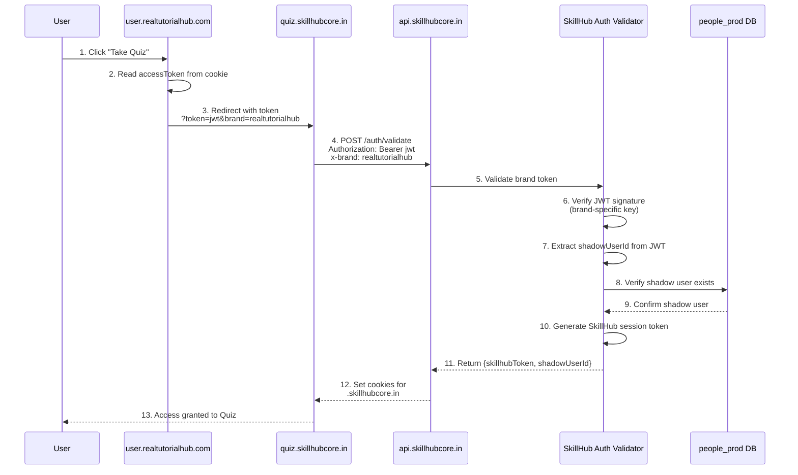
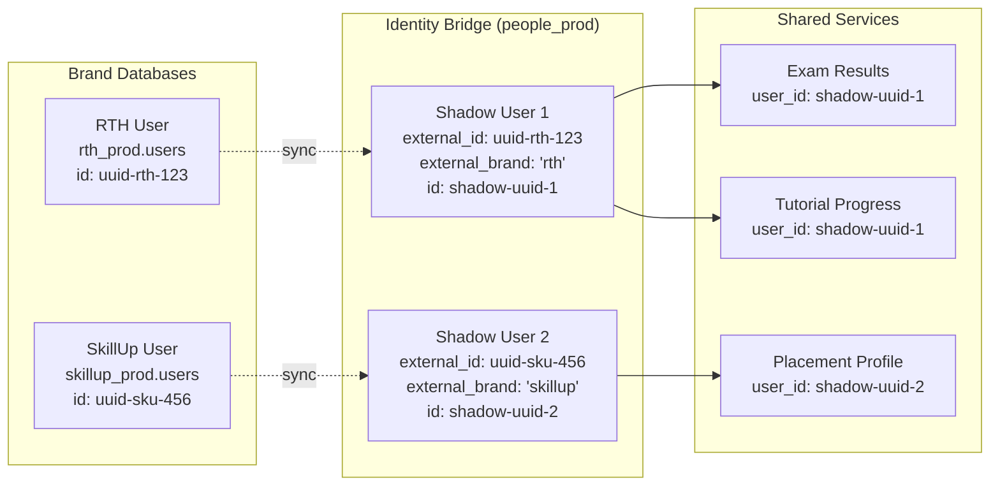

# Multi-Brand Authentication Architecture - Design Document

## Overview

This design document specifies a comprehensive multi-brand authentication architecture that maintains brand isolation while enabling shared services across Real Tutorial Hub (RTH) and SkillUp IT Academy. The architecture implements FAANG-grade patterns from day one, including Repository Pattern, Dependency Injection, DTOs, structured logging, OpenTelemetry, rate limiting, and comprehensive testing.

### Goals

1. **Brand Isolation**: Separate user databases (rth_prod, skillup_prod) with independent authentication
2. **Shared Services**: Unified access to Tutorial Engine, Exam Engine, and Placement services via skillhubcore.in
3. **Cross-Domain Authentication**: Seamless user experience across brand and shared domains
4. **User Identity Bridge**: Shadow users in people_prod linking brand identities to shared services
5. **FAANG Compliance**: Built-in quality standards including 90%+ test coverage, Repository Pattern, DI, DTOs, structured logging, and OpenTelemetry

### Architecture Principles

- **Repository Pattern**: All database access via Repository classes, no direct DB calls in services
- **Dependency Injection**: All services use DI, no static methods
- **DTOs**: All API boundaries use typed DTO objects, no raw DB types in responses
- **Structured Logging**: Pino logger with correlation IDs, no console.log
- **OpenTelemetry**: Wrap critical operations with withSpan()
- **Rate Limiting**: Every public endpoint protected
- **Idempotency**: Every worker has idempotency key check
- **Zod Validation**: Every API input validated
- **Transactions**: Multi-step writes wrapped in db.transaction()
- **Audit Trail**: Every auth action logged to auth_audit_log
- **Soft Deletes**: All tables have deleted_at column

---

## Architecture

### High-Level System Architecture



### Brand Authentication Flow



### Cross-Domain Authentication Flow



### User Identity Bridge Pattern



---

## Components and Interfaces

### 1. RTH Auth Service

**Location**: `services/rth-auth-service`  
**Database**: `rth_prod`  
**Responsibilities**:
- User registration for RTH brand
- User login/logout for RTH brand
- Password reset for RTH brand
- JWT generation with brand="realtutorialhub"
- Cookie management for `.realtutorialhub.com`
- User sync to people_prod via Identity Bridge

**Dependencies**:
- `RthDatabase` (rth_prod connection)
- `PeopleDatabase` (people_prod connection)
- `UserIdentityBridgeService`
- `TokenService`
- `PasswordService`
- `Logger` (Pino with correlation IDs)

### 2. SkillUp Auth Service

**Location**: `services/skillup-auth-service`  
**Database**: `skillup_prod`  
**Responsibilities**:
- User registration for SkillUp brand
- User login/logout for SkillUp brand
- Password reset for SkillUp brand
- JWT generation with brand="skillup"
- Cookie management for `.skillupitacademy.com`
- User sync to people_prod via Identity Bridge

**Dependencies**:
- `SkillUpDatabase` (skillup_prod connection)
- `PeopleDatabase` (people_prod connection)
- `UserIdentityBridgeService`
- `TokenService`
- `PasswordService`
- `Logger` (Pino with correlation IDs)

### 3. User Identity Bridge Service

**Location**: `packages/identity-bridge`  
**Database**: `people_prod`  
**Responsibilities**:
- Sync brand users to people_prod
- Create shadow users for shared services
- Maintain external_id → shadow_id mapping
- Grant platform access permissions

**Dependencies**:
- `PeopleDatabase` (people_prod connection)
- `Logger` (Pino with correlation IDs)

### 4. SkillHub Auth Validator

**Location**: `services/skillhub-auth-validator`  
**Database**: `people_prod`  
**Responsibilities**:
- Validate JWT tokens from RTH or SkillUp
- Extract user identity and brand from token
- Verify shadow user exists in people_prod
- Generate SkillHub session tokens
- Set cookies for `.skillhubcore.in`

**Dependencies**:
- `PeopleDatabase` (people_prod connection)
- `UserIdentityBridgeService`
- `TokenService`
- `Logger` (Pino with correlation IDs)

### 5. API Gateways

#### RTH API Gateway
**Location**: `services/api-gateway-rth`  
**Domain**: `api.realtutorialhub.com`  
**Routing**:
- `/auth/*` → RTH Auth Service
- `/*` → SkillHub API (with x-brand: realtutorialhub)

#### SkillUp API Gateway
**Location**: `services/api-gateway-skillup`  
**Domain**: `api.skillupitacademy.com`  
**Routing**:
- `/auth/*` → SkillUp Auth Service
- `/*` → SkillHub API (with x-brand: skillup)

#### SkillHub API Gateway
**Location**: `services/api-gateway-skillhub`  
**Domain**: `api.skillhubcore.in`  
**Routing**:
- `/quiz/*` → Quiz Service
- `/exam/*` → Quiz Service
- `/tutorial/*` → Tutorial Service
- `/placement/*` → Placement Service
- `/payment/*` → Payment Service

---

## Data Models

### RTH Brand Database (rth_prod)

```sql
-- Users table
CREATE TABLE users (
  id UUID PRIMARY KEY DEFAULT gen_random_uuid(),
  email TEXT NOT NULL UNIQUE,
  password_hash TEXT NOT NULL,
  email_verified BOOLEAN NOT NULL DEFAULT FALSE,
  is_blocked BOOLEAN NOT NULL DEFAULT FALSE,
  last_active_at TIMESTAMP,
  deleted_at TIMESTAMP,  -- Soft delete
  created_at TIMESTAMP NOT NULL DEFAULT NOW(),
  updated_at TIMESTAMP NOT NULL DEFAULT NOW()
);

CREATE INDEX idx_users_email ON users(email) WHERE deleted_at IS NULL;
CREATE INDEX idx_users_deleted ON users(deleted_at) WHERE deleted_at IS NOT NULL;

-- User profiles
CREATE TABLE user_profiles (
  id UUID PRIMARY KEY DEFAULT gen_random_uuid(),
  user_id UUID NOT NULL REFERENCES users(id) ON DELETE CASCADE,
  name TEXT NOT NULL,
  education_level TEXT,
  professional_status TEXT,
  deleted_at TIMESTAMP,
  created_at TIMESTAMP NOT NULL DEFAULT NOW(),
  updated_at TIMESTAMP NOT NULL DEFAULT NOW()
);

CREATE INDEX idx_user_profiles_user_id ON user_profiles(user_id) WHERE deleted_at IS NULL;

-- Roles
CREATE TABLE roles (
  id UUID PRIMARY KEY DEFAULT gen_random_uuid(),
  name TEXT NOT NULL UNIQUE,  -- USER, ADMIN, SUPER_ADMIN
  created_at TIMESTAMP NOT NULL DEFAULT NOW()
);

-- User roles (many-to-many)
CREATE TABLE user_roles (
  user_id UUID NOT NULL REFERENCES users(id) ON DELETE CASCADE,
  role_id UUID NOT NULL REFERENCES roles(id) ON DELETE CASCADE,
  created_at TIMESTAMP NOT NULL DEFAULT NOW(),
  PRIMARY KEY (user_id, role_id)
);

-- Auth audit log
CREATE TABLE auth_audit_log (
  id UUID PRIMARY KEY DEFAULT gen_random_uuid(),
  user_id UUID REFERENCES users(id),
  action TEXT NOT NULL,  -- login, logout, password_reset, etc.
  ip_address TEXT,
  user_agent TEXT,
  success BOOLEAN NOT NULL,
  error_message TEXT,
  metadata JSONB,
  created_at TIMESTAMP NOT NULL DEFAULT NOW()
);

CREATE INDEX idx_auth_audit_log_user_id ON auth_audit_log(user_id);
CREATE INDEX idx_auth_audit_log_created_at ON auth_audit_log(created_at DESC);
```

### SkillUp Brand Database (skillup_prod)

Same schema as `rth_prod` plus:

```sql
-- Faculty table (SkillUp-specific)
CREATE TABLE faculty (
  id UUID PRIMARY KEY DEFAULT gen_random_uuid(),
  user_id UUID NOT NULL REFERENCES users(id) ON DELETE CASCADE,
  specialization TEXT[],
  availability_type TEXT NOT NULL,  -- fulltime, parttime, contract
  status TEXT NOT NULL,  -- active, inactive, on_leave
  deleted_at TIMESTAMP,
  created_at TIMESTAMP NOT NULL DEFAULT NOW(),
  updated_at TIMESTAMP NOT NULL DEFAULT NOW()
);

CREATE INDEX idx_faculty_user_id ON faculty(user_id) WHERE deleted_at IS NULL;
CREATE INDEX idx_faculty_status ON faculty(status) WHERE deleted_at IS NULL;

-- Batches table (SkillUp-specific)
CREATE TABLE batches (
  id UUID PRIMARY KEY DEFAULT gen_random_uuid(),
  name TEXT NOT NULL,
  mode TEXT NOT NULL,  -- online, offline, hybrid
  status TEXT NOT NULL,  -- upcoming, active, completed, cancelled
  start_date DATE NOT NULL,
  end_date DATE,
  deleted_at TIMESTAMP,
  created_at TIMESTAMP NOT NULL DEFAULT NOW(),
  updated_at TIMESTAMP NOT NULL DEFAULT NOW()
);

CREATE INDEX idx_batches_status ON batches(status) WHERE deleted_at IS NULL;
CREATE INDEX idx_batches_start_date ON batches(start_date) WHERE deleted_at IS NULL;
```

### People Database (people_prod) - Identity Bridge

```sql
-- Shadow users for shared services
CREATE TABLE users (
  id UUID PRIMARY KEY DEFAULT gen_random_uuid(),
  external_id TEXT NOT NULL,  -- User ID from brand database
  external_brand TEXT NOT NULL,  -- 'rth' or 'skillup'
  email TEXT NOT NULL,
  platform TEXT NOT NULL,  -- 'realtutorialhub' or 'skillup'
  role TEXT NOT NULL DEFAULT 'student',
  deleted_at TIMESTAMP,
  created_at TIMESTAMP NOT NULL DEFAULT NOW(),
  updated_at TIMESTAMP NOT NULL DEFAULT NOW(),
  UNIQUE(external_id, external_brand)
);

CREATE INDEX idx_users_external ON users(external_id, external_brand) WHERE deleted_at IS NULL;
CREATE INDEX idx_users_email ON users(email) WHERE deleted_at IS NULL;

-- Platform access control
CREATE TABLE platform_access (
  id UUID PRIMARY KEY DEFAULT gen_random_uuid(),
  user_id UUID NOT NULL REFERENCES users(id) ON DELETE CASCADE,
  platform TEXT NOT NULL,  -- 'realtutorialhub', 'skillup', 'quiz', 'tutorial', 'placement'
  granted_at TIMESTAMP NOT NULL DEFAULT NOW(),
  UNIQUE(user_id, platform)
);

CREATE INDEX idx_platform_access_user_id ON platform_access(user_id);

-- SSO sessions for SkillHub
CREATE TABLE sso_sessions (
  id UUID PRIMARY KEY DEFAULT gen_random_uuid(),
  user_id UUID NOT NULL REFERENCES users(id) ON DELETE CASCADE,
  session_token TEXT NOT NULL UNIQUE,
  brand TEXT NOT NULL,  -- 'realtutorialhub' or 'skillup'
  expires_at TIMESTAMP NOT NULL,
  created_at TIMESTAMP NOT NULL DEFAULT NOW()
);

CREATE INDEX idx_sso_sessions_user_id ON sso_sessions(user_id);
CREATE INDEX idx_sso_sessions_token ON sso_sessions(session_token);
CREATE INDEX idx_sso_sessions_expires_at ON sso_sessions(expires_at);
```

### Database Connection Configuration

All database connections MUST follow FAANG compliance:

```typescript
// packages/db-rth/src/index.ts
import { drizzle } from 'drizzle-orm/postgres-js';
import postgres from 'postgres';

// Pooled connection for runtime queries
const queryClient = postgres(process.env.DATABASE_URL_RTH!, {
  max: 10,
  idle_timeout: 20,
  connect_timeout: 10,
  statement_timeout: 30000,  // 30 seconds - FAANG requirement
});

export const db = drizzle(queryClient);

// Direct connection for migrations only
const migrationClient = postgres(process.env.DATABASE_DIRECT_URL_RTH!, {
  max: 1,
});

export const dbDirect = drizzle(migrationClient);

// Read-only connection for analytics (CQRS pattern)
const readOnlyClient = postgres(process.env.DATABASE_URL_RTH_READONLY!, {
  max: 5,
  statement_timeout: 30000,
});

export const dbReadOnly = drizzle(readOnlyClient);
```

---

## Low-Level Design

### Repository Interfaces

```typescript
// packages/types/src/repositories/IUserRepository.ts
import type { UserDTO, CreateUserDTO, UpdateUserDTO } from '../dtos';

export interface IUserRepository {
  findById(id: string): Promise<UserDTO | null>;
  findByEmail(email: string): Promise<UserDTO | null>;
  findByExternalId(externalId: string, externalBrand: string): Promise<UserDTO | null>;
  create(data: CreateUserDTO): Promise<UserDTO>;
  update(id: string, data: UpdateUserDTO): Promise<UserDTO>;
  softDelete(id: string): Promise<void>;
  findAll(filters?: UserFilters): Promise<UserDTO[]>;
}

export interface UserFilters {
  email?: string;
  role?: string;
  isBlocked?: boolean;
  limit?: number;
  offset?: number;
}
```

### DTOs (Data Transfer Objects)

```typescript
// packages/types/src/dtos/user.dto.ts
import { z } from 'zod';

export const UserDTOSchema = z.object({
  id: z.string().uuid(),
  email: z.string().email(),
  emailVerified: z.boolean(),
  isBlocked: z.boolean(),
  lastActiveAt: z.date().nullable(),
  createdAt: z.date(),
  updatedAt: z.date(),
  roles: z.array(z.string()),
});

export type UserDTO = z.infer<typeof UserDTOSchema>;

export const CreateUserDTOSchema = z.object({
  email: z.string().email(),
  password: z.string().min(8),
  name: z.string().min(1),
});

export type CreateUserDTO = z.infer<typeof CreateUserDTOSchema>;

export const UpdateUserDTOSchema = z.object({
  email: z.string().email().optional(),
  emailVerified: z.boolean().optional(),
  isBlocked: z.boolean().optional(),
  lastActiveAt: z.date().optional(),
});

export type UpdateUserDTO = z.infer<typeof UpdateUserDTOSchema>;

// Auth DTOs
export const LoginRequestDTOSchema = z.object({
  email: z.string().email(),
  password: z.string().min(1),
});

export type LoginRequestDTO = z.infer<typeof LoginRequestDTOSchema>;

export const AuthResultDTOSchema = z.object({
  user: UserDTOSchema,
  accessToken: z.string(),
  refreshToken: z.string(),
  shadowUserId: z.string().uuid(),
});

export type AuthResultDTO = z.infer<typeof AuthResultDTOSchema>;
```

### Repository Implementation

```typescript
// services/rth-auth-service/src/repositories/DrizzleUserRepository.ts
import type { IUserRepository } from '@quiz/types';
import type { UserDTO, CreateUserDTO, UpdateUserDTO, UserFilters } from '@quiz/types';
import { db } from '@quiz/db-rth';
import { users, userRoles, roles } from '@quiz/db-rth/schema';
import { eq, and, isNull, sql } from 'drizzle-orm';
import { withTimeout, STANDARD_QUERY_TIMEOUT } from '@quiz/db-rth/utils';
import { logger } from '@/utils/logger';

export class DrizzleUserRepository implements IUserRepository {
  constructor(private readonly database = db) {}

  async findById(id: string): Promise<UserDTO | null> {
    return withTimeout(
      async () => {
        const result = await this.database
          .select({
            id: users.id,
            email: users.email,
            emailVerified: users.emailVerified,
            isBlocked: users.isBlocked,
            lastActiveAt: users.lastActiveAt,
            createdAt: users.createdAt,
            updatedAt: users.updatedAt,
          })
          .from(users)
          .where(and(eq(users.id, id), isNull(users.deletedAt)))
          .limit(1);

        if (result.length === 0) return null;

        const user = result[0];
        const userRolesList = await this.getUserRoles(id);

        return {
          ...user,
          roles: userRolesList,
        };
      },
      STANDARD_QUERY_TIMEOUT,
      'DrizzleUserRepository.findById'
    );
  }

  async findByEmail(email: string): Promise<UserDTO | null> {
    return withTimeout(
      async () => {
        const result = await this.database
          .select({
            id: users.id,
            email: users.email,
            emailVerified: users.emailVerified,
            isBlocked: users.isBlocked,
            lastActiveAt: users.lastActiveAt,
            createdAt: users.createdAt,
            updatedAt: users.updatedAt,
          })
          .from(users)
          .where(and(eq(users.email, email.toLowerCase()), isNull(users.deletedAt)))
          .limit(1);

        if (result.length === 0) return null;

        const user = result[0];
        const userRolesList = await this.getUserRoles(user.id);

        return {
          ...user,
          roles: userRolesList,
        };
      },
      STANDARD_QUERY_TIMEOUT,
      'DrizzleUserRepository.findByEmail'
    );
  }

  async findByExternalId(externalId: string, externalBrand: string): Promise<UserDTO | null> {
    // This method is for people_prod shadow users
    throw new Error('Not implemented for brand database');
  }

  async create(data: CreateUserDTO): Promise<UserDTO> {
    return withTimeout(
      async () => {
        const result = await this.database
          .insert(users)
          .values({
            email: data.email.toLowerCase(),
            passwordHash: data.password, // Should be hashed before calling this
            emailVerified: false,
            isBlocked: false,
          })
          .returning({
            id: users.id,
            email: users.email,
            emailVerified: users.emailVerified,
            isBlocked: users.isBlocked,
            lastActiveAt: users.lastActiveAt,
            createdAt: users.createdAt,
            updatedAt: users.updatedAt,
          });

        const user = result[0];

        // Assign default USER role
        await this.assignRole(user.id, 'USER');

        return {
          ...user,
          roles: ['USER'],
        };
      },
      STANDARD_QUERY_TIMEOUT,
      'DrizzleUserRepository.create'
    );
  }

  async update(id: string, data: UpdateUserDTO): Promise<UserDTO> {
    return withTimeout(
      async () => {
        const result = await this.database
          .update(users)
          .set({
            ...data,
            updatedAt: new Date(),
          })
          .where(and(eq(users.id, id), isNull(users.deletedAt)))
          .returning({
            id: users.id,
            email: users.email,
            emailVerified: users.emailVerified,
            isBlocked: users.isBlocked,
            lastActiveAt: users.lastActiveAt,
            createdAt: users.createdAt,
            updatedAt: users.updatedAt,
          });

        if (result.length === 0) {
          throw new Error(`User ${id} not found`);
        }

        const user = result[0];
        const userRolesList = await this.getUserRoles(id);

        return {
          ...user,
          roles: userRolesList,
        };
      },
      STANDARD_QUERY_TIMEOUT,
      'DrizzleUserRepository.update'
    );
  }

  async softDelete(id: string): Promise<void> {
    return withTimeout(
      async () => {
        await this.database
          .update(users)
          .set({
            deletedAt: new Date(),
            updatedAt: new Date(),
          })
          .where(eq(users.id, id));

        logger.info({ userId: id, action: 'user.soft_deleted' }, 'User soft deleted');
      },
      STANDARD_QUERY_TIMEOUT,
      'DrizzleUserRepository.softDelete'
    );
  }

  async findAll(filters?: UserFilters): Promise<UserDTO[]> {
    return withTimeout(
      async () => {
        let query = this.database
          .select({
            id: users.id,
            email: users.email,
            emailVerified: users.emailVerified,
            isBlocked: users.isBlocked,
            lastActiveAt: users.lastActiveAt,
            createdAt: users.createdAt,
            updatedAt: users.updatedAt,
          })
          .from(users)
          .where(isNull(users.deletedAt));

        if (filters?.email) {
          query = query.where(eq(users.email, filters.email.toLowerCase()));
        }

        if (filters?.isBlocked !== undefined) {
          query = query.where(eq(users.isBlocked, filters.isBlocked));
        }

        if (filters?.limit) {
          query = query.limit(filters.limit);
        }

        if (filters?.offset) {
          query = query.offset(filters.offset);
        }

        const results = await query;

        // Fetch roles for all users
        const usersWithRoles = await Promise.all(
          results.map(async (user) => ({
            ...user,
            roles: await this.getUserRoles(user.id),
          }))
        );

        return usersWithRoles;
      },
      STANDARD_QUERY_TIMEOUT,
      'DrizzleUserRepository.findAll'
    );
  }

  private async getUserRoles(userId: string): Promise<string[]> {
    const result = await this.database
      .select({ name: roles.name })
      .from(userRoles)
      .innerJoin(roles, eq(userRoles.roleId, roles.id))
      .where(eq(userRoles.userId, userId));

    return result.map((r) => r.name);
  }

  private async assignRole(userId: string, roleName: string): Promise<void> {
    const role = await this.database
      .select({ id: roles.id })
      .from(roles)
      .where(eq(roles.name, roleName))
      .limit(1);

    if (role.length === 0) {
      throw new Error(`Role ${roleName} not found`);
    }

    await this.database.insert(userRoles).values({
      userId,
      roleId: role[0].id,
    });
  }
}
```


### RTH Auth Service Implementation

```typescript
// services/rth-auth-service/src/services/RthAuthService.ts
import type { IUserRepository } from '@quiz/types';
import type { AuthResultDTO, LoginRequestDTO, CreateUserDTO } from '@quiz/types';
import { UserIdentityBridgeService } from '@quiz/identity-bridge';
import { TokenService } from './TokenService';
import { PasswordService } from './PasswordService';
import { logger } from '@/utils/logger';
import { withSpan } from '@/utils/telemetry';
import { db } from '@quiz/db-rth';

export class RthAuthService {
  constructor(
    private readonly userRepo: IUserRepository,
    private readonly identityBridge: UserIdentityBridgeService,
    private readonly tokenService: TokenService,
    private readonly passwordService: PasswordService
  ) {}

  async login(
    credentials: LoginRequestDTO,
    ip: string,
    userAgent: string
  ): Promise<AuthResultDTO> {
    return withSpan('rth.auth.login', async (span) => {
      span.setAttribute('email', credentials.email);
      span.setAttribute('ip', ip);

      try {
        // 1. Find user by email
        const user = await this.userRepo.findByEmail(credentials.email);

        if (!user) {
          logger.warn(
            { email: credentials.email, ip, action: 'login.failed' },
            'User not found'
          );
          throw new Error('Invalid credentials');
        }

        // 2. Check if user is blocked
        if (user.isBlocked) {
          logger.warn(
            { userId: user.id, email: user.email, ip, action: 'login.blocked' },
            'Blocked user attempted login'
          );
          throw new Error('Account is blocked');
        }

        // 3. Validate password
        const isValidPassword = await this.passwordService.verify(
          credentials.password,
          user.passwordHash
        );

        if (!isValidPassword) {
          logger.warn(
            { userId: user.id, email: user.email, ip, action: 'login.invalid_password' },
            'Invalid password'
          );
          await this.logAuthAttempt(user.id, 'login', ip, userAgent, false, 'Invalid password');
          throw new Error('Invalid credentials');
        }

        // 4. Sync user to people_prod (create shadow user)
        const syncResult = await this.identityBridge.syncUser({
          externalId: user.id,
          externalBrand: 'rth',
          email: user.email,
          platform: 'realtutorialhub',
        });

        span.setAttribute('shadowUserId', syncResult.shadowUserId);

        // 5. Generate JWT tokens
        const accessToken = await this.tokenService.generateAccessToken({
          userId: user.id,
          shadowUserId: syncResult.shadowUserId,
          email: user.email,
          brand: 'realtutorialhub',
          roles: user.roles,
        });

        const refreshToken = await this.tokenService.generateRefreshToken({
          userId: user.id,
          shadowUserId: syncResult.shadowUserId,
        });

        // 6. Update last active timestamp
        await this.userRepo.update(user.id, {
          lastActiveAt: new Date(),
        });

        // 7. Log successful login
        await this.logAuthAttempt(user.id, 'login', ip, userAgent, true);

        logger.info(
          {
            userId: user.id,
            shadowUserId: syncResult.shadowUserId,
            email: user.email,
            ip,
            action: 'login.success',
          },
          'User logged in successfully'
        );

        return {
          user,
          accessToken,
          refreshToken,
          shadowUserId: syncResult.shadowUserId,
        };
      } catch (error) {
        span.recordException(error as Error);
        throw error;
      }
    });
  }

  async register(data: CreateUserDTO, ip: string, userAgent: string): Promise<AuthResultDTO> {
    return withSpan('rth.auth.register', async (span) => {
      span.setAttribute('email', data.email);

      try {
        // 1. Check if user already exists
        const existingUser = await this.userRepo.findByEmail(data.email);

        if (existingUser) {
          logger.warn(
            { email: data.email, ip, action: 'register.duplicate' },
            'User already exists'
          );
          throw new Error('User already exists');
        }

        // 2. Hash password
        const passwordHash = await this.passwordService.hash(data.password);

        // 3. Create user in rth_prod
        const user = await this.userRepo.create({
          ...data,
          password: passwordHash,
        });

        span.setAttribute('userId', user.id);

        // 4. Sync to people_prod
        const syncResult = await this.identityBridge.syncUser({
          externalId: user.id,
          externalBrand: 'rth',
          email: user.email,
          platform: 'realtutorialhub',
        });

        span.setAttribute('shadowUserId', syncResult.shadowUserId);

        // 5. Generate tokens
        const accessToken = await this.tokenService.generateAccessToken({
          userId: user.id,
          shadowUserId: syncResult.shadowUserId,
          email: user.email,
          brand: 'realtutorialhub',
          roles: user.roles,
        });

        const refreshToken = await this.tokenService.generateRefreshToken({
          userId: user.id,
          shadowUserId: syncResult.shadowUserId,
        });

        // 6. Log registration
        await this.logAuthAttempt(user.id, 'register', ip, userAgent, true);

        logger.info(
          {
            userId: user.id,
            shadowUserId: syncResult.shadowUserId,
            email: user.email,
            ip,
            action: 'register.success',
          },
          'User registered successfully'
        );

        return {
          user,
          accessToken,
          refreshToken,
          shadowUserId: syncResult.shadowUserId,
        };
      } catch (error) {
        span.recordException(error as Error);
        throw error;
      }
    });
  }

  private async logAuthAttempt(
    userId: string,
    action: string,
    ip: string,
    userAgent: string,
    success: boolean,
    errorMessage?: string
  ): Promise<void> {
    await db.insert(authAuditLog).values({
      userId,
      action,
      ipAddress: ip,
      userAgent,
      success,
      errorMessage,
      metadata: {},
    });
  }
}
```


### User Identity Bridge Service Implementation

```typescript
// packages/identity-bridge/src/UserIdentityBridgeService.ts
import type { SyncUserInput, SyncUserResult } from './types';
import { db } from '@quiz/db-people';
import { users, platformAccess } from '@quiz/db-people/schema';
import { eq, and, isNull } from 'drizzle-orm';
import { logger } from './utils/logger';
import { withSpan } from './utils/telemetry';
import { withTimeout, STANDARD_QUERY_TIMEOUT } from '@quiz/db-people/utils';

export interface SyncUserInput {
  externalId: string;        // User ID from brand database
  externalBrand: 'rth' | 'skillup';
  email: string;
  platform: 'realtutorialhub' | 'skillup';
}

export interface SyncUserResult {
  shadowUserId: string;      // User ID in people_prod
  created: boolean;          // Whether user was newly created
}

export class UserIdentityBridgeService {
  constructor(private readonly database = db) {}

  async syncUser(input: SyncUserInput): Promise<SyncUserResult> {
    return withSpan('identity.bridge.sync_user', async (span) => {
      span.setAttribute('externalId', input.externalId);
      span.setAttribute('externalBrand', input.externalBrand);
      span.setAttribute('platform', input.platform);

      return withTimeout(
        async () => {
          // 1. Check if shadow user exists
          const existing = await this.database
            .select({
              id: users.id,
              email: users.email,
            })
            .from(users)
            .where(
              and(
                eq(users.externalId, input.externalId),
                eq(users.externalBrand, input.externalBrand),
                isNull(users.deletedAt)
              )
            )
            .limit(1);

          if (existing.length > 0) {
            const shadowUser = existing[0];

            // 2. Update existing shadow user
            await this.database
              .update(users)
              .set({
                email: input.email,
                updatedAt: new Date(),
              })
              .where(eq(users.id, shadowUser.id));

            logger.info(
              {
                shadowUserId: shadowUser.id,
                externalId: input.externalId,
                externalBrand: input.externalBrand,
                action: 'identity.bridge.updated',
              },
              'Shadow user updated'
            );

            span.setAttribute('shadowUserId', shadowUser.id);
            span.setAttribute('created', false);

            return {
              shadowUserId: shadowUser.id,
              created: false,
            };
          }

          // 3. Create new shadow user
          const newUser = await this.database
            .insert(users)
            .values({
              externalId: input.externalId,
              externalBrand: input.externalBrand,
              email: input.email,
              platform: input.platform,
              role: 'student', // Default role
            })
            .returning({
              id: users.id,
            });

          const shadowUserId = newUser[0].id;

          // 4. Grant platform access
          await this.database.insert(platformAccess).values({
            userId: shadowUserId,
            platform: input.platform,
          });

          logger.info(
            {
              shadowUserId,
              externalId: input.externalId,
              externalBrand: input.externalBrand,
              platform: input.platform,
              action: 'identity.bridge.created',
            },
            'Shadow user created'
          );

          span.setAttribute('shadowUserId', shadowUserId);
          span.setAttribute('created', true);

          return {
            shadowUserId,
            created: true,
          };
        },
        STANDARD_QUERY_TIMEOUT,
        'UserIdentityBridgeService.syncUser'
      );
    });
  }

  async getShadowUserId(
    externalId: string,
    externalBrand: 'rth' | 'skillup'
  ): Promise<string | null> {
    return withSpan('identity.bridge.get_shadow_user_id', async (span) => {
      span.setAttribute('externalId', externalId);
      span.setAttribute('externalBrand', externalBrand);

      return withTimeout(
        async () => {
          const result = await this.database
            .select({ id: users.id })
            .from(users)
            .where(
              and(
                eq(users.externalId, externalId),
                eq(users.externalBrand, externalBrand),
                isNull(users.deletedAt)
              )
            )
            .limit(1);

          if (result.length === 0) {
            return null;
          }

          const shadowUserId = result[0].id;
          span.setAttribute('shadowUserId', shadowUserId);

          return shadowUserId;
        },
        STANDARD_QUERY_TIMEOUT,
        'UserIdentityBridgeService.getShadowUserId'
      );
    });
  }

  async grantPlatformAccess(shadowUserId: string, platform: string): Promise<void> {
    return withSpan('identity.bridge.grant_platform_access', async (span) => {
      span.setAttribute('shadowUserId', shadowUserId);
      span.setAttribute('platform', platform);

      return withTimeout(
        async () => {
          // Check if access already granted
          const existing = await this.database
            .select()
            .from(platformAccess)
            .where(
              and(
                eq(platformAccess.userId, shadowUserId),
                eq(platformAccess.platform, platform)
              )
            )
            .limit(1);

          if (existing.length > 0) {
            logger.info(
              { shadowUserId, platform, action: 'identity.bridge.access_already_granted' },
              'Platform access already granted'
            );
            return;
          }

          await this.database.insert(platformAccess).values({
            userId: shadowUserId,
            platform,
          });

          logger.info(
            { shadowUserId, platform, action: 'identity.bridge.access_granted' },
            'Platform access granted'
          );
        },
        STANDARD_QUERY_TIMEOUT,
        'UserIdentityBridgeService.grantPlatformAccess'
      );
    });
  }
}
```


### SkillHub Auth Validator Implementation

```typescript
// services/skillhub-auth-validator/src/SkillHubAuthValidator.ts
import type { ValidationResult, SkillHubTokenPayload } from './types';
import { UserIdentityBridgeService } from '@quiz/identity-bridge';
import { TokenService } from './TokenService';
import { logger } from '@/utils/logger';
import { withSpan } from '@/utils/telemetry';
import { db } from '@quiz/db-people';
import { ssoSessions } from '@quiz/db-people/schema';

export interface ValidationResult {
  valid: boolean;
  shadowUserId: string;
  brand: 'realtutorialhub' | 'skillup';
  skillhubToken: string;
  originalUserId: string;
  roles: string[];
}

export class SkillHubAuthValidator {
  constructor(
    private readonly identityBridge: UserIdentityBridgeService,
    private readonly tokenService: TokenService
  ) {}

  async validateBrandToken(
    token: string,
    brand: 'realtutorialhub' | 'skillup'
  ): Promise<ValidationResult> {
    return withSpan('skillhub.auth.validate_brand_token', async (span) => {
      span.setAttribute('brand', brand);

      try {
        // 1. Verify JWT signature (use brand-specific public key)
        const payload = await this.tokenService.verifyBrandToken(token, brand);

        span.setAttribute('originalUserId', payload.userId);
        span.setAttribute('shadowUserId', payload.shadowUserId);

        // 2. Extract user info from token
        const { userId, shadowUserId, email, roles } = payload;

        // 3. Ensure shadow user exists in people_prod
        let finalShadowUserId = shadowUserId;

        if (!shadowUserId) {
          // Token doesn't have shadowUserId (old token format)
          // Sync user to people_prod
          const syncResult = await this.identityBridge.syncUser({
            externalId: userId,
            externalBrand: brand === 'realtutorialhub' ? 'rth' : 'skillup',
            email,
            platform: brand,
          });

          finalShadowUserId = syncResult.shadowUserId;
          span.setAttribute('shadowUserId', finalShadowUserId);
        }

        // 4. Generate SkillHub session token
        const skillhubToken = await this.tokenService.generateSkillHubToken({
          shadowUserId: finalShadowUserId,
          brand,
          originalUserId: userId,
          roles,
        });

        // 5. Store SSO session in people_prod
        await this.createSSOSession(finalShadowUserId, skillhubToken, brand);

        logger.info(
          {
            shadowUserId: finalShadowUserId,
            originalUserId: userId,
            brand,
            action: 'skillhub.auth.validated',
          },
          'Brand token validated successfully'
        );

        return {
          valid: true,
          shadowUserId: finalShadowUserId,
          brand,
          skillhubToken,
          originalUserId: userId,
          roles,
        };
      } catch (error) {
        span.recordException(error as Error);
        logger.error(
          { brand, error: (error as Error).message, action: 'skillhub.auth.validation_failed' },
          'Brand token validation failed'
        );

        throw new Error('Invalid token');
      }
    });
  }

  async verifySkillHubToken(token: string): Promise<SkillHubTokenPayload> {
    return withSpan('skillhub.auth.verify_skillhub_token', async (span) => {
      try {
        const payload = await this.tokenService.verifySkillHubToken(token);

        span.setAttribute('shadowUserId', payload.shadowUserId);
        span.setAttribute('brand', payload.brand);

        return payload;
      } catch (error) {
        span.recordException(error as Error);
        throw new Error('Invalid SkillHub token');
      }
    });
  }

  private async createSSOSession(
    shadowUserId: string,
    sessionToken: string,
    brand: 'realtutorialhub' | 'skillup'
  ): Promise<void> {
    const expiresAt = new Date();
    expiresAt.setHours(expiresAt.getHours() + 24); // 24 hour session

    await db.insert(ssoSessions).values({
      userId: shadowUserId,
      sessionToken,
      brand,
      expiresAt,
    });

    logger.info(
      { shadowUserId, brand, expiresAt, action: 'skillhub.auth.sso_session_created' },
      'SSO session created'
    );
  }
}
```

### Token Service Implementation

```typescript
// packages/auth/src/TokenService.ts
import jwt from 'jsonwebtoken';
import { logger } from './utils/logger';

export interface AccessTokenPayload {
  userId: string;
  shadowUserId: string;
  email: string;
  brand: 'realtutorialhub' | 'skillup';
  roles: string[];
}

export interface RefreshTokenPayload {
  userId: string;
  shadowUserId: string;
}

export interface SkillHubTokenPayload {
  shadowUserId: string;
  brand: 'realtutorialhub' | 'skillup';
  originalUserId: string;
  roles: string[];
}

export class TokenService {
  private readonly accessTokenSecret: string;
  private readonly refreshTokenSecret: string;
  private readonly skillhubTokenSecret: string;
  private readonly accessTokenExpiry: string = '15m';
  private readonly refreshTokenExpiry: string = '7d';
  private readonly skillhubTokenExpiry: string = '24h';

  constructor() {
    this.accessTokenSecret = process.env.JWT_ACCESS_SECRET!;
    this.refreshTokenSecret = process.env.JWT_REFRESH_SECRET!;
    this.skillhubTokenSecret = process.env.JWT_SKILLHUB_SECRET!;

    if (!this.accessTokenSecret || !this.refreshTokenSecret || !this.skillhubTokenSecret) {
      throw new Error('JWT secrets not configured');
    }
  }

  async generateAccessToken(payload: AccessTokenPayload): Promise<string> {
    return jwt.sign(
      {
        userId: payload.userId,
        shadowUserId: payload.shadowUserId,
        email: payload.email,
        brand: payload.brand,
        roles: payload.roles,
        type: 'access',
      },
      this.accessTokenSecret,
      {
        expiresIn: this.accessTokenExpiry,
        issuer: `auth.${payload.brand}`,
        audience: payload.brand,
      }
    );
  }

  async generateRefreshToken(payload: RefreshTokenPayload): Promise<string> {
    return jwt.sign(
      {
        userId: payload.userId,
        shadowUserId: payload.shadowUserId,
        type: 'refresh',
      },
      this.refreshTokenSecret,
      {
        expiresIn: this.refreshTokenExpiry,
      }
    );
  }

  async generateSkillHubToken(payload: SkillHubTokenPayload): Promise<string> {
    return jwt.sign(
      {
        shadowUserId: payload.shadowUserId,
        brand: payload.brand,
        originalUserId: payload.originalUserId,
        roles: payload.roles,
        type: 'skillhub',
      },
      this.skillhubTokenSecret,
      {
        expiresIn: this.skillhubTokenExpiry,
        issuer: 'auth.skillhubcore',
        audience: 'skillhubcore',
      }
    );
  }

  async verifyBrandToken(token: string, brand: 'realtutorialhub' | 'skillup'): Promise<AccessTokenPayload> {
    try {
      const decoded = jwt.verify(token, this.accessTokenSecret, {
        audience: brand,
      }) as any;

      if (decoded.type !== 'access') {
        throw new Error('Invalid token type');
      }

      return {
        userId: decoded.userId,
        shadowUserId: decoded.shadowUserId,
        email: decoded.email,
        brand: decoded.brand,
        roles: decoded.roles,
      };
    } catch (error) {
      logger.error({ error: (error as Error).message }, 'Token verification failed');
      throw new Error('Invalid token');
    }
  }

  async verifySkillHubToken(token: string): Promise<SkillHubTokenPayload> {
    try {
      const decoded = jwt.verify(token, this.skillhubTokenSecret, {
        audience: 'skillhubcore',
      }) as any;

      if (decoded.type !== 'skillhub') {
        throw new Error('Invalid token type');
      }

      return {
        shadowUserId: decoded.shadowUserId,
        brand: decoded.brand,
        originalUserId: decoded.originalUserId,
        roles: decoded.roles,
      };
    } catch (error) {
      logger.error({ error: (error as Error).message }, 'SkillHub token verification failed');
      throw new Error('Invalid SkillHub token');
    }
  }
}
```


### API Gateway Implementation (Hono on Cloudflare Workers)

```typescript
// services/api-gateway-rth/src/index.ts
import { Hono } from 'hono';
import { cors } from 'hono/cors';
import { logger } from 'hono/logger';
import { rateLimiter } from './middleware/rateLimiter';
import { requestId } from './middleware/requestId';

const app = new Hono();

// Environment variables
interface Env {
  RTH_AUTH_SERVICE_URL: string;
  SKILLHUB_API_URL: string;
  COOKIE_DOMAIN: string;
  BRAND: string;
}

// Middleware
app.use('*', logger());
app.use('*', requestId());
app.use('*', cors({
  origin: [
    'https://user.realtutorialhub.com',
    'https://admin.realtutorialhub.com',
    'https://quiz.skillhubcore.in',
    'https://tutorial.skillhubcore.in',
    'https://placement.skillhubcore.in',
  ],
  credentials: true,
}));

// Rate limiting
app.use('/auth/login', rateLimiter({ tier: 'AUTH', limit: 5, window: 60 }));
app.use('/auth/register', rateLimiter({ tier: 'GENERAL', limit: 10, window: 3600 }));

// Auth routes - proxy to RTH Auth Service
app.all('/auth/*', async (c) => {
  const env = c.env as Env;
  const path = c.req.path.replace('/auth', '');
  const url = `${env.RTH_AUTH_SERVICE_URL}/auth${path}`;

  const response = await fetch(url, {
    method: c.req.method,
    headers: {
      ...Object.fromEntries(c.req.raw.headers),
      'x-brand': env.BRAND,
      'x-request-id': c.get('requestId'),
    },
    body: c.req.method !== 'GET' ? await c.req.raw.clone().text() : undefined,
  });

  // Copy response headers
  const headers = new Headers(response.headers);

  // Set cookies for brand domain
  if (headers.has('set-cookie')) {
    const cookies = headers.get('set-cookie')!;
    headers.set('set-cookie', cookies.replace(/Domain=[^;]+/g, `Domain=${env.COOKIE_DOMAIN}`));
  }

  return new Response(response.body, {
    status: response.status,
    headers,
  });
});

// All other routes - proxy to SkillHub API with brand context
app.all('/*', async (c) => {
  const env = c.env as Env;
  const url = `${env.SKILLHUB_API_URL}${c.req.path}`;

  const response = await fetch(url, {
    method: c.req.method,
    headers: {
      ...Object.fromEntries(c.req.raw.headers),
      'x-brand': env.BRAND,
      'x-request-id': c.get('requestId'),
    },
    body: c.req.method !== 'GET' ? await c.req.raw.clone().text() : undefined,
  });

  return new Response(response.body, {
    status: response.status,
    headers: response.headers,
  });
});

export default app;
```

```typescript
// services/api-gateway-skillhub/src/index.ts
import { Hono } from 'hono';
import { cors } from 'hono/cors';
import { logger } from 'hono/logger';
import { rateLimiter } from './middleware/rateLimiter';
import { requestId } from './middleware/requestId';
import { authMiddleware } from './middleware/auth';

const app = new Hono();

interface Env {
  QUIZ_SERVICE_URL: string;
  TUTORIAL_SERVICE_URL: string;
  PLACEMENT_SERVICE_URL: string;
  PAYMENT_SERVICE_URL: string;
}

// Middleware
app.use('*', logger());
app.use('*', requestId());
app.use('*', cors({
  origin: [
    'https://quiz.skillhubcore.in',
    'https://tutorial.skillhubcore.in',
    'https://placement.skillhubcore.in',
  ],
  credentials: true,
}));

// Auth validation endpoint
app.post('/auth/validate', async (c) => {
  const token = c.req.header('authorization')?.replace('Bearer ', '');
  const brand = c.req.header('x-brand') as 'realtutorialhub' | 'skillup';

  if (!token || !brand) {
    return c.json({ error: 'Missing token or brand' }, 400);
  }

  // Call SkillHub Auth Validator service
  const response = await fetch(`${c.env.SKILLHUB_AUTH_VALIDATOR_URL}/validate`, {
    method: 'POST',
    headers: {
      'Content-Type': 'application/json',
      'x-request-id': c.get('requestId'),
    },
    body: JSON.stringify({ token, brand }),
  });

  if (!response.ok) {
    return c.json({ error: 'Invalid token' }, 401);
  }

  const result = await response.json();

  // Set SkillHub cookies
  c.header('Set-Cookie', `skillhub_accessToken=${result.skillhubToken}; Domain=.skillhubcore.in; Path=/; HttpOnly; Secure; SameSite=Lax; Max-Age=86400`);

  return c.json(result);
});

// Protected routes - require SkillHub auth
app.use('/*', authMiddleware());

// Quiz/Exam routes
app.all('/quiz/*', async (c) => {
  const env = c.env as Env;
  const path = c.req.path.replace('/quiz', '');
  const url = `${env.QUIZ_SERVICE_URL}${path}`;

  return proxyRequest(c, url);
});

app.all('/exam/*', async (c) => {
  const env = c.env as Env;
  const path = c.req.path.replace('/exam', '');
  const url = `${env.QUIZ_SERVICE_URL}${path}`;

  return proxyRequest(c, url);
});

// Tutorial routes
app.all('/tutorial/*', async (c) => {
  const env = c.env as Env;
  const path = c.req.path.replace('/tutorial', '');
  const url = `${env.TUTORIAL_SERVICE_URL}${path}`;

  return proxyRequest(c, url);
});

// Placement routes
app.all('/placement/*', async (c) => {
  const env = c.env as Env;
  const path = c.req.path.replace('/placement', '');
  const url = `${env.PLACEMENT_SERVICE_URL}${path}`;

  return proxyRequest(c, url);
});

// Payment routes
app.all('/payment/*', async (c) => {
  const env = c.env as Env;
  const path = c.req.path.replace('/payment', '');
  const url = `${env.PAYMENT_SERVICE_URL}${path}`;

  return proxyRequest(c, url);
});

async function proxyRequest(c: any, url: string) {
  const response = await fetch(url, {
    method: c.req.method,
    headers: {
      ...Object.fromEntries(c.req.raw.headers),
      'x-shadow-user-id': c.get('shadowUserId'),
      'x-brand': c.get('brand'),
      'x-request-id': c.get('requestId'),
    },
    body: c.req.method !== 'GET' ? await c.req.raw.clone().text() : undefined,
  });

  return new Response(response.body, {
    status: response.status,
    headers: response.headers,
  });
}

export default app;
```

### Rate Limiting Middleware

```typescript
// services/api-gateway-rth/src/middleware/rateLimiter.ts
import { Ratelimit } from '@upstash/ratelimit';
import { Redis } from '@upstash/redis';

const redis = new Redis({
  url: process.env.UPSTASH_REDIS_REST_URL!,
  token: process.env.UPSTASH_REDIS_REST_TOKEN!,
});

const rateLimiters = {
  AUTH: new Ratelimit({
    redis,
    limiter: Ratelimit.slidingWindow(5, '1 m'),
    analytics: true,
  }),
  GENERAL: new Ratelimit({
    redis,
    limiter: Ratelimit.slidingWindow(60, '1 m'),
    analytics: true,
  }),
  ADMIN: new Ratelimit({
    redis,
    limiter: Ratelimit.slidingWindow(30, '1 m'),
    analytics: true,
  }),
};

export function rateLimiter(config: { tier: keyof typeof rateLimiters; limit?: number; window?: number }) {
  return async (c: any, next: any) => {
    const limiter = rateLimiters[config.tier];
    const identifier = c.req.header('x-forwarded-for') || c.req.header('cf-connecting-ip') || 'unknown';

    const { success, limit, remaining, reset } = await limiter.limit(identifier);

    c.header('X-RateLimit-Limit', limit.toString());
    c.header('X-RateLimit-Remaining', remaining.toString());
    c.header('X-RateLimit-Reset', reset.toString());

    if (!success) {
      return c.json(
        {
          error: 'Rate limit exceeded',
          retryAfter: Math.ceil((reset - Date.now()) / 1000),
        },
        429
      );
    }

    await next();
  };
}
```


---

## Correctness Properties

*A property is a characteristic or behavior that should hold true across all valid executions of a system—essentially, a formal statement about what the system should do. Properties serve as the bridge between human-readable specifications and machine-verifiable correctness guarantees.*

### Property Reflection

After analyzing all acceptance criteria, I identified the following redundancies:
- BR-1.1 and BR-1.2 can be combined into a single property about brand database isolation
- BR-2.1 and BR-2.2 can be combined into a property about shared service access for all brands
- BR-2.3, BR-2.4, and BR-2.5 are all about shadow user ID consistency - can be combined
- BR-4.1 and BR-4.2 can be combined into a property about cookie domain correctness
- TR-4.1 and TR-4.2 can be combined into a property about user sync to people_prod
- CP-1 and NFR-2 are the same property (brand isolation)
- CP-2 subsumes BR-4.1 and BR-4.2

After consolidation, here are the unique, non-redundant properties:

### Property 1: Brand Database Isolation

*For any* user registration or login operation, the user data MUST be stored in and retrieved from the correct brand database (rth_prod for RTH users, skillup_prod for SkillUp users), and MUST NOT be accessible from the other brand's database.

**Validates: Requirements BR-1.1, BR-1.2, BR-1.3, BR-1.4, CP-1, NFR-2**

### Property 2: Shadow User Sync

*For any* user authentication (RTH or SkillUp), the auth service MUST sync the user to people_prod via the Identity Bridge, creating or updating a shadow user with the correct external_id, external_brand, and platform values.

**Validates: Requirements TR-4.1, TR-4.2, TR-5.1**

### Property 3: Shadow User ID Consistency

*For any* user accessing shared services (quiz, tutorial, placement), the same shadow user ID MUST be used across all services, regardless of which service is accessed first or in what order.

**Validates: Requirements BR-2.3, BR-2.4, BR-2.5, CP-4**

### Property 4: Cross-Domain Authentication

*For any* authenticated user from either brand, they MUST be able to successfully access shared services on skillhubcore.in domain after token validation, with the SkillHub validator creating a valid session.

**Validates: Requirements BR-2.1, BR-2.2, CP-3**

### Property 5: Cookie Domain Correctness

*For any* authentication operation, cookies MUST be set with the correct domain (.realtutorialhub.com for RTH, .skillupitacademy.com for SkillUp, .skillhubcore.in for SkillHub), and MUST include HttpOnly and Secure flags.

**Validates: Requirements BR-4.1, BR-4.2, BR-4.3, BR-4.4, CP-2, NFR-4**

### Property 6: JWT Structure Consistency

*For any* JWT token generated by any auth service (RTH, SkillUp, or SkillHub), the token MUST contain the required fields (userId or shadowUserId, email or brand, roles) and MUST include a 'brand' claim indicating the originating brand.

**Validates: Requirements BR-3.3, NFR-3**

### Property 7: External ID Mapping Invariant

*For any* combination of external_id and external_brand, the Identity Bridge MUST always return the same shadow user ID, ensuring that getShadowUserId is idempotent and deterministic.

**Validates: Requirements TR-5.2**

### Property 8: API Gateway Routing

*For any* request to a brand API gateway, auth routes (/auth/*) MUST be proxied to the brand-specific auth service, and all other routes MUST be proxied to SkillHub API with the correct x-brand header.

**Validates: Requirements TR-3.1, TR-3.2, TR-3.3**

### Property 9: Token Validation Round Trip

*For any* valid brand token, the SkillHub Auth Validator MUST successfully validate it and generate a SkillHub token, and that SkillHub token MUST be verifiable and contain the correct shadow user ID and brand information.

**Validates: Requirements TR-7.1, TR-7.2**

### Property 10: Authentication Error Consistency

*For any* authentication error (invalid credentials, blocked user, expired token), all auth services MUST return errors in a consistent format with appropriate HTTP status codes and error messages.

**Validates: Requirements BR-3.4**

### Property 11: User Sync Performance

*For any* user sync operation to people_prod, the Identity Bridge MUST complete the operation in less than 100ms under normal load conditions.

**Validates: Requirements NFR-1**

### Property 12: No Cross-Brand Cookie Leakage

*For any* HTTP request, cookies from one brand domain MUST NOT be sent to another brand's domain (RTH cookies not sent to SkillUp domains and vice versa).

**Validates: Requirements BR-4.4**

---

## Error Handling

### Error Types

```typescript
// packages/types/src/errors/AuthErrors.ts
export class AuthError extends Error {
  constructor(
    message: string,
    public readonly code: string,
    public readonly statusCode: number,
    public readonly details?: Record<string, any>
  ) {
    super(message);
    this.name = 'AuthError';
  }
}

export class InvalidCredentialsError extends AuthError {
  constructor(message = 'Invalid credentials') {
    super(message, 'INVALID_CREDENTIALS', 401);
  }
}

export class UserBlockedError extends AuthError {
  constructor(message = 'Account is blocked') {
    super(message, 'USER_BLOCKED', 403);
  }
}

export class TokenExpiredError extends AuthError {
  constructor(message = 'Token has expired') {
    super(message, 'TOKEN_EXPIRED', 401);
  }
}

export class InvalidTokenError extends AuthError {
  constructor(message = 'Invalid token') {
    super(message, 'INVALID_TOKEN', 401);
  }
}

export class UserNotFoundError extends AuthError {
  constructor(message = 'User not found') {
    super(message, 'USER_NOT_FOUND', 404);
  }
}

export class DuplicateUserError extends AuthError {
  constructor(message = 'User already exists') {
    super(message, 'DUPLICATE_USER', 409);
  }
}

export class RateLimitError extends AuthError {
  constructor(message = 'Rate limit exceeded', retryAfter: number) {
    super(message, 'RATE_LIMIT_EXCEEDED', 429, { retryAfter });
  }
}

export class DatabaseError extends AuthError {
  constructor(message = 'Database operation failed') {
    super(message, 'DATABASE_ERROR', 500);
  }
}
```

### Error Handling Middleware

```typescript
// services/rth-auth-service/src/middleware/errorHandler.ts
import type { Context, Next } from 'hono';
import { AuthError } from '@quiz/types';
import { logger } from '@/utils/logger';

export async function errorHandler(c: Context, next: Next) {
  try {
    await next();
  } catch (error) {
    const requestId = c.get('requestId');

    if (error instanceof AuthError) {
      logger.warn(
        {
          requestId,
          error: error.message,
          code: error.code,
          statusCode: error.statusCode,
          details: error.details,
        },
        'Auth error occurred'
      );

      return c.json(
        {
          error: {
            message: error.message,
            code: error.code,
            details: error.details,
          },
          requestId,
        },
        error.statusCode
      );
    }

    // Unexpected error
    logger.error(
      {
        requestId,
        error: (error as Error).message,
        stack: (error as Error).stack,
      },
      'Unexpected error occurred'
    );

    return c.json(
      {
        error: {
          message: 'Internal server error',
          code: 'INTERNAL_ERROR',
        },
        requestId,
      },
      500
    );
  }
}
```

### Circuit Breaker Pattern

```typescript
// packages/resilience/src/CircuitBreaker.ts
export enum CircuitState {
  CLOSED = 'CLOSED',
  OPEN = 'OPEN',
  HALF_OPEN = 'HALF_OPEN',
}

export interface CircuitBreakerOptions {
  failureThreshold: number;
  successThreshold: number;
  timeout: number;
  resetTimeout: number;
}

export class CircuitBreaker {
  private state: CircuitState = CircuitState.CLOSED;
  private failureCount = 0;
  private successCount = 0;
  private nextAttempt = Date.now();

  constructor(private readonly options: CircuitBreakerOptions) {}

  async execute<T>(fn: () => Promise<T>): Promise<T> {
    if (this.state === CircuitState.OPEN) {
      if (Date.now() < this.nextAttempt) {
        throw new Error('Circuit breaker is OPEN');
      }
      this.state = CircuitState.HALF_OPEN;
    }

    try {
      const result = await Promise.race([
        fn(),
        new Promise<never>((_, reject) =>
          setTimeout(() => reject(new Error('Timeout')), this.options.timeout)
        ),
      ]);

      this.onSuccess();
      return result;
    } catch (error) {
      this.onFailure();
      throw error;
    }
  }

  private onSuccess(): void {
    this.failureCount = 0;

    if (this.state === CircuitState.HALF_OPEN) {
      this.successCount++;
      if (this.successCount >= this.options.successThreshold) {
        this.state = CircuitState.CLOSED;
        this.successCount = 0;
      }
    }
  }

  private onFailure(): void {
    this.failureCount++;
    this.successCount = 0;

    if (this.failureCount >= this.options.failureThreshold) {
      this.state = CircuitState.OPEN;
      this.nextAttempt = Date.now() + this.options.resetTimeout;
    }
  }

  getState(): CircuitState {
    return this.state;
  }
}
```

---

## Testing Strategy

### Dual Testing Approach

This architecture requires both unit tests and property-based tests for comprehensive coverage:

**Unit Tests**: Verify specific examples, edge cases, and error conditions
- Specific login scenarios (valid credentials, invalid credentials, blocked user)
- Token generation and validation with known inputs
- Database operations with mock data
- Error handling paths

**Property-Based Tests**: Verify universal properties across all inputs
- Brand isolation holds for any user credentials
- Shadow user ID consistency for any sequence of service accesses
- Cookie domain correctness for any authentication operation
- JWT structure validity for any generated token

Together, unit tests catch concrete bugs while property tests verify general correctness.

### Property-Based Testing Configuration

**Library**: fast-check (TypeScript/JavaScript)  
**Minimum Iterations**: 100 per property test  
**Tag Format**: `Feature: multi-brand-auth-architecture, Property {number}: {property_text}`

### Test Structure

```typescript
// services/rth-auth-service/tests/properties/brand-isolation.property.test.ts
import { describe, it, expect } from 'vitest';
import * as fc from 'fast-check';
import { RthAuthService } from '@/services/RthAuthService';
import { mockUserRepository, mockIdentityBridge } from '../mocks';

describe('Property 1: Brand Database Isolation', () => {
  it('should store RTH users only in rth_prod database', async () => {
    // Feature: multi-brand-auth-architecture, Property 1: Brand Database Isolation
    await fc.assert(
      fc.asyncProperty(
        fc.record({
          email: fc.emailAddress(),
          password: fc.string({ minLength: 8 }),
          name: fc.string({ minLength: 1 }),
        }),
        async (userData) => {
          const userRepo = mockUserRepository();
          const identityBridge = mockIdentityBridge();
          const authService = new RthAuthService(userRepo, identityBridge, tokenService, passwordService);

          // Register user
          await authService.register(userData, '127.0.0.1', 'test-agent');

          // Verify user exists in RTH repository
          const rthUser = await userRepo.findByEmail(userData.email);
          expect(rthUser).toBeDefined();

          // Verify user does NOT exist in SkillUp repository (simulated)
          const skillupUser = await mockSkillUpRepository().findByEmail(userData.email);
          expect(skillupUser).toBeNull();
        }
      ),
      { numRuns: 100 }
    );
  });
});
```

```typescript
// packages/identity-bridge/tests/properties/shadow-user-consistency.property.test.ts
import { describe, it, expect } from 'vitest';
import * as fc from 'fast-check';
import { UserIdentityBridgeService } from '@/UserIdentityBridgeService';

describe('Property 7: External ID Mapping Invariant', () => {
  it('should return same shadow user ID for same external_id + external_brand', async () => {
    // Feature: multi-brand-auth-architecture, Property 7: External ID Mapping Invariant
    await fc.assert(
      fc.asyncProperty(
        fc.record({
          externalId: fc.uuid(),
          externalBrand: fc.constantFrom('rth', 'skillup'),
          email: fc.emailAddress(),
          platform: fc.constantFrom('realtutorialhub', 'skillup'),
        }),
        async (userData) => {
          const identityBridge = new UserIdentityBridgeService();

          // Sync user first time
          const result1 = await identityBridge.syncUser(userData);

          // Sync same user again
          const result2 = await identityBridge.syncUser(userData);

          // Shadow user ID should be the same
          expect(result1.shadowUserId).toBe(result2.shadowUserId);

          // First call creates, second call updates
          expect(result1.created).toBe(true);
          expect(result2.created).toBe(false);

          // getShadowUserId should return same ID
          const shadowUserId = await identityBridge.getShadowUserId(
            userData.externalId,
            userData.externalBrand
          );
          expect(shadowUserId).toBe(result1.shadowUserId);
        }
      ),
      { numRuns: 100 }
    );
  });
});
```

### Unit Test Coverage Requirements

All services MUST achieve minimum 90% test coverage:
- Statements: 90%
- Branches: 85%
- Functions: 90%
- Lines: 90%

### Integration Tests

```typescript
// tests/integration/cross-domain-auth.integration.test.ts
import { describe, it, expect, beforeAll, afterAll } from 'vitest';
import { startTestServer } from './utils/testServer';

describe('Cross-Domain Authentication Flow', () => {
  let rthAuthServer: any;
  let skillhubValidator: any;

  beforeAll(async () => {
    rthAuthServer = await startTestServer('rth-auth-service');
    skillhubValidator = await startTestServer('skillhub-auth-validator');
  });

  afterAll(async () => {
    await rthAuthServer.stop();
    await skillhubValidator.stop();
  });

  it('should complete full cross-domain auth flow', async () => {
    // 1. Register user on RTH
    const registerResponse = await fetch(`${rthAuthServer.url}/auth/register`, {
      method: 'POST',
      headers: { 'Content-Type': 'application/json' },
      body: JSON.stringify({
        email: 'test@example.com',
        password: 'password123',
        name: 'Test User',
      }),
    });

    expect(registerResponse.status).toBe(201);
    const { accessToken, shadowUserId } = await registerResponse.json();

    // 2. Validate token with SkillHub
    const validateResponse = await fetch(`${skillhubValidator.url}/validate`, {
      method: 'POST',
      headers: {
        'Content-Type': 'application/json',
      },
      body: JSON.stringify({
        token: accessToken,
        brand: 'realtutorialhub',
      }),
    });

    expect(validateResponse.status).toBe(200);
    const { skillhubToken, shadowUserId: validatedShadowUserId } = await validateResponse.json();

    // 3. Verify shadow user ID matches
    expect(validatedShadowUserId).toBe(shadowUserId);

    // 4. Verify SkillHub token is valid
    expect(skillhubToken).toBeDefined();
  });
});
```


---

## Implementation Phases

### Phase 1: Database Setup and Identity Bridge (Week 1)

**Tasks**:
1. Create `rth_prod` database with schema (users, user_profiles, roles, user_roles, auth_audit_log)
2. Create `skillup_prod` database with schema (same as rth_prod + faculty, batches)
3. Update `people_prod` schema (add external_id, external_brand columns, create indexes)
4. Implement `packages/db-rth` with Drizzle ORM
5. Implement `packages/db-skillup` with Drizzle ORM
6. Implement `packages/db-people` updates
7. Implement `packages/identity-bridge` with UserIdentityBridgeService
8. Write unit tests for Identity 