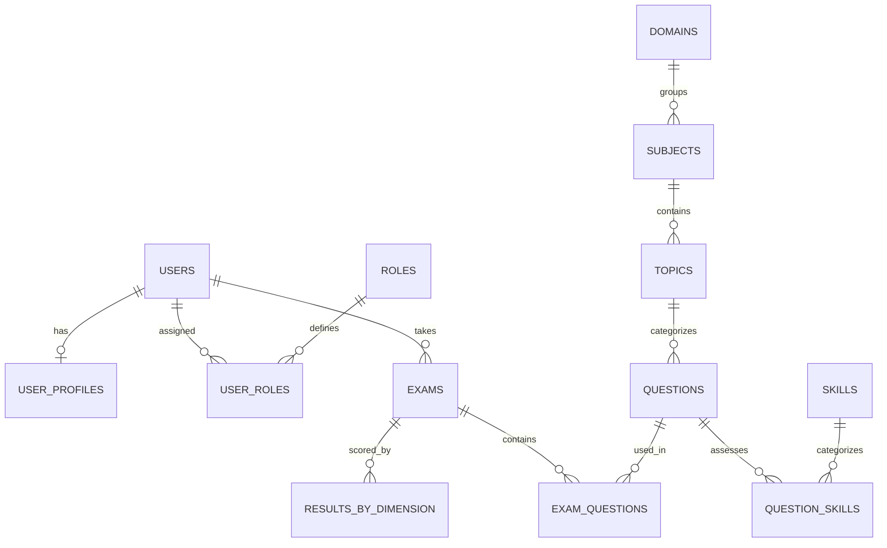

# Database Architecture & Scalability Analysis Report

**Date:** March 17, 2026  
**Auditor:** Senior Backend Engineer & Database Analyst  
**Objective:** Evaluation of current database schema for high-scale EdTech platform (1k to 100k+ students).

---

## SECTION 1 — DATABASE TECHNOLOGY

*   **Database Engine:** PostgreSQL (Deployed on **Neon** serverless)
*   **ORM / Query Builder:** **Drizzle ORM** (Type-safe, low runtime overhead)
*   **Migration system:** **Drizzle Kit** (SQL-based migrations)
*   **Connection pooling:** **Neon Serverless Driver** (HTTP/WebSocket based protocol). Utilizes `sql` (primary) and `sqlReplica` (read replica) clients for horizontal read scaling.

---

## SECTION 2 — COMPLETE TABLE LIST

| Table Name | Purpose | Estimated Row Growth |
| :--- | :--- | :--- |
| `users` | Core identity and account status | High |
| `user_profiles` | Extended PII and adaptive learning metadata | High |
| `roles` / `user_roles` | RBAC (Role Based Access Control) | Medium / High |
| `sessions` | Auth session tracking | Very High (requires pruning) |
| `refresh_tokens` | JWT refresh tokens | High |
| `audit_logs` | Security and activity tracking | **Extremely High** |
| `login_attempts` | Rate limiting / Brute force protection | High |
| `exam_blueprints` | Templates for exam generation | Medium |
| `exams` | Active and historical exam sessions | **Very High** |
| `exam_questions` | Individual question-to-exam mapping + Answers | **Extremely High** |
| `idempotency_keys` | API request deduplication | High |
| `results_by_dimension` | Analytics snapshots per exam (Domain/Skill/Topic) | **Very High** |
| `questions` | The central question bank | Medium |
| `question_skills` | N:M mapping for questions to skills | High |
| `domains` / `subjects` / `topics` | Educational hierarchy | Low / Medium |
| `background_jobs` | Tracking async tasks (Scoring, PDF generation) | High |
| `notifications` | In-app user alerts | High |
| `reports` | Metadata for generated PDF reports | High |
| `user_recommendations` | AI-driven adaptive learning suggestions | High |

---

## SECTION 3 — TABLE STRUCTURE (KEY TABLES)

### Table: `users`
| Column | Data Type | Description |
| :--- | :--- | :--- |
| `id` | uuid | Primary Key (Random UUID) |
| `email` | text | Unique user identifier |
| `password_hash` | text | Standard bcrypt/argon2 hash |
| `is_blocked` | boolean | Fraud/Security flag |
| `last_active_at` | timestamp | Last session activity |

### Table: `exams`
| Column | Data Type | Description |
| :--- | :--- | :--- |
| `id` | uuid | Primary Key |
| `user_id` | uuid | FK to users |
| `status` | enum | started, processing, completed, abandoned, failed |
| `total_score` | integer | Final calculated score |
| `duration_seconds` | integer | Time limit enforcement |
| `report_materialized`| jsonb | Denormalized report data for performance |

### Table: `exam_questions` (The "Answer" Table)
| Column | Data Type | Description |
| :--- | :--- | :--- |
| `id` | uuid | Primary Key |
| `exam_id` | uuid | FK to exams |
| `question_id` | uuid | FK to questions |
| `user_answer` | text | The student's raw submission |
| `is_correct` | boolean | Boolean result (null until scored) |
| `response_metadata` | jsonb | Time spent, first answer timestamp |
| `order` | integer | Position in the exam sequence |

---

## SECTION 4 — RELATIONSHIPS



---

## SECTION 5 — INDEXES

| table_name | index_name | columns |
| :--- | :--- | :--- |
| `users` | `idx_users_created_at` | `created_at` |
| `exams` | `idx_exams_user_id_status` | `user_id`, `status` |
| `exams` | `idx_exams_dashboard_opt` | `user_id`, `status`, `completed_at` (desc) |
| `exam_questions`| `unq_exam_question` | `exam_id`, `question_id` (Unique) |
| `exam_questions`| `idx_exam_questions_exam_order`| `exam_id`, `order` |
| `questions` | `idx_questions_selection_filter`| `topic_id`, `subtopic_id`, `difficulty` |
| `idempotency_keys`| `unq_user_key` | `user_id`, `key` (Unique) |
| `audit_logs` | `idx_audit_logs_user_id` | `user_id` |

---

## SECTION 6 — EXAM ENGINE DATA FLOW

The system implements a **Hybrid Strategy** for real-time exam management:

1.  **Initialization (`startExam`)**: 
    - Question selection via `SelectionService` based on `domain`/`difficulty`.
    - Record created in `exams`.
    - 10–50 records inserted into `exam_questions`.
2.  **Interaction Phase (`submitAnswer`)**:
    - **Performance Optimization**: Answers are first written to **Redis** (`exam-state:{examId}:q:{questionId}`) to minimize Postgres write pressure during peak concurrent exams.
    - Database `exams.last_answered_at` updated for session heartbeat.
3.  **Completion Phase (`completeExam`)**:
    - **Flush Logic**: Cached answers are read from Redis and written to `exam_questions` in a single database transaction. 
    - Status set to `processing`.
4.  **Async Processing (`ExamSaga`)**:
    - Triggered via Upstash Workflow/QStash.
    - **Step 1**: `ScoringEngine` compares `user_answer` to `correct_answer`.
    - **Step 2**: Dimension-level results calculated and stored in `results_by_dimension`.
    - **Step 3**: PDF report generation and persistent storage.

---

## SECTION 7 — ANSWER STORAGE STRATEGY

**Strategy: Option A (1 row per answer)**

The system stores each answer as a distinct row in the `exam_questions` join table. This provides maximum granularity for analytics but poses the highest storage overhead.

**Example Record (`exam_questions`):**
```json
{
  "id": "uuid-123",
  "exam_id": "exam-uuid-456",
  "question_id": "q-uuid-789",
  "user_answer": "42",
  "is_correct": true,
  "response_metadata": {
    "timeSpentSeconds": 15,
    "firstAnsweredAt": "2026-03-17T22:00:15Z"
  },
  "order": 1
}
```

---

## SECTION 8 — DATA VOLUME ESTIMATION

*Baseline: Assumes 1 student takes 10 exams, each with 20 questions.*

| Table | 1,000 Students | 10,000 Students | 100,000 Students |
| :--- | :--- | :--- | :--- |
| **`users`** | 1,000 | 10,000 | 100,000 |
| **`exams`** | 10,000 | 100,000 | 1,000,000 |
| **`exam_questions`**| 200,000 | 2.0M | **20M** |
| **`results_by_dimension`**| 50,000 | 500,000 | **5.0M** |
| **`audit_logs`** | ~1.0M | ~10M | **~100M** |

---

## SECTION 9 — CURRENT PERFORMANCE RISKS

1.  **`exam_questions` Table Bloat**: At 100k students, this table will exceed **20 million rows** rapidly. Without **Table Partitioning** (e.g., by `exam_id` or `created_at`), queries on historical results will degrade.
2.  **Audit Log Growth**: The `audit_logs` table is the highest growth risk. It requires an aggressive **Archival Strategy** or offloading to a dedicated logging service (like Sentry/Datadog or a cold-storage DB).
3.  **JSONB Querying**: `exams.report_materialized` and `exams.export_urls` are stored as JSONB. While flexible, frequent filtering on nested fields within these columns will be slow without GIN indexes.
4.  **N+1 Query Hazards**: The admin dashboard attempts to aggregate results across students. If not using the `results_by_dimension` table or materialized views, these "large joins" will time out on Neon's free tier and impact performance on paid tiers.
5.  **Concurrent Session Pruning**: The `sessions` and `refresh_tokens` tables have no automated cleanup logic visible in the schema, which will lead to "zombie rows" over time.
6.  **Redis-to-DB Flush Concentration**: If 10,000 students finish a 1-hour exam simultaneously, the bulk flush of answers from Redis to Postgres will create a massive **Write Burst**, potentially exceeding Neon's connection limits or IOPS capacity.

---

## SECTION 10 — SUMMARY & RECOMMENDATION

The current schema is well-normalized and utilizes the modern features of Drizzle and Neon effectively. However, for a 100k+ student scale, the architect should prioritize:
- **Postgres Table Partitioning** for `exam_questions`.
- **Materialized Views** for the Admin Dashboard.
- **Async Write-Ahead Logging** for `audit_logs`.
- **Row-Level Security (RLS)** is enabled implicitly via UUIDs but should be strictly enforced at the DB level for high-concurrency security.
