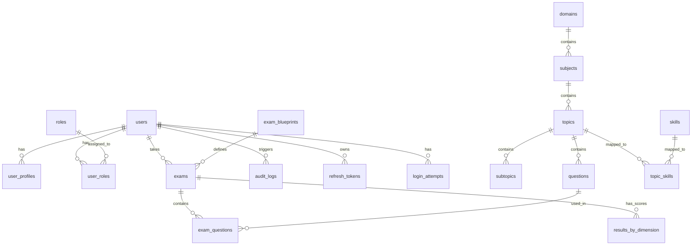

# Quiz Platform: Entity Relationship Diagram

This diagram visualizes how the database tables are interconnected to support the Admin Dashboard metrics and platform logic.

## Schema Coverage for Admin Dashboard

| Spec Section | Authoritative Database Table |
| :--- | :--- |
| **User Overview** | `users`, `login_attempts` |
| **RBAC Governance** | `roles`, `user_roles` |
| **Security Health** | `audit_logs`, `refresh_tokens`, `login_attempts` |
| **Curriculum Structure** | `domains`, `subjects`, `topics`, `skills` |
| **Question Bank Health** | `questions` |
| **Blueprint Monitoring** | `exam_blueprints` |
| **Exam Activity** | `exams` |
| **Performance Analytics** | `results_by_dimension` |
| **System Audit Terminal** | `audit_logs` |

---
## Change Log
- **2026-01-27**: Created `DATABASE_ERD.md` in `docs/architecture` per user request and AGENT_CONSTITUTION_v1.1 compliance.
