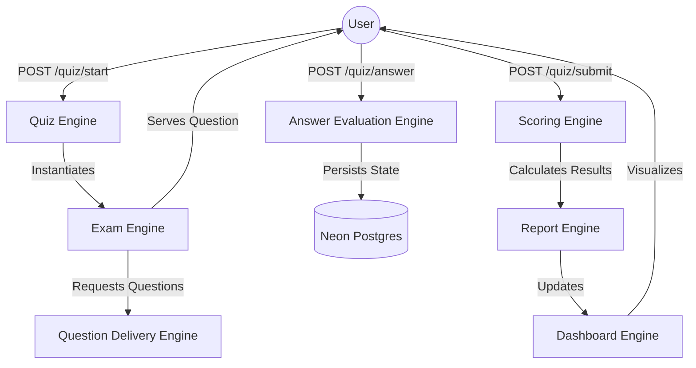
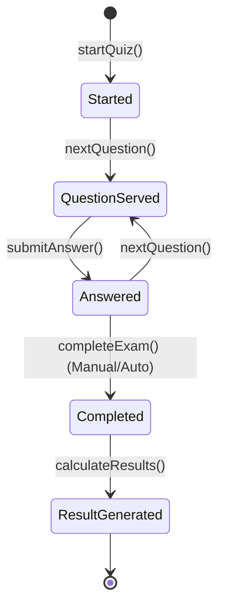
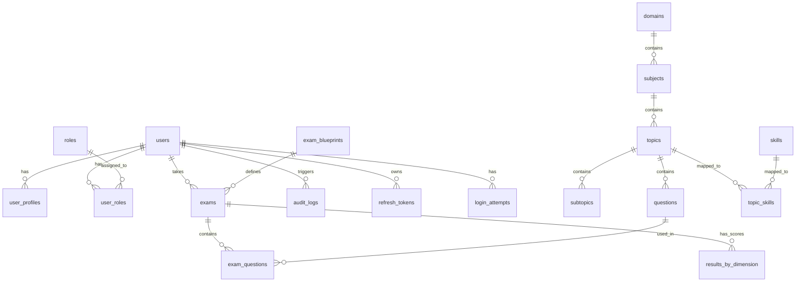

# 🏛️ System Architecture

This document serves as the master architectural reference for the Quiz Platform, consolidating the Entity Relationship Diagram, Runtime Engine logic, and Scoring Engine specifications.

---

## 1. Runtime Engine Architecture
*Source: runtime-engine-architecture.md*

### Overview
The Runtime Engine Layer orchestrates the live behavior of the platform, managing the transition from static content models to interactive user sessions.

### Runtime Flow Diagram


### Session Lifecycle Diagram


### Internal Engines
- **Quiz Engine**: Lifecycle & State management.
- **Exam Engine**: Session timing & submission flow.
- **Question Delivery**: Streaming & Randomization.
- **Answer Evaluation**: Content-aware correctness check.
- **Scoring Engine**: Multi-dimensional point calculation.
- **Report Engine**: Mastery & Progress analysis.
- **Admin Engine**: Publishing, Approval workflows, and advanced User Discovery filtering.

---

## 2. Database Entity Relationship Diagram
*Source: DATABASE_ERD.md*

This diagram visualizes how the database tables are interconnected to support the Admin Dashboard metrics and platform logic.



```

### Schema Code Mapping
Physical location: `packages/db/src/schema/`

| File | Tables Defined | Purpose |
| :--- | :--- | :--- |
| **`auth.ts`** | `users`, `sessions`, `roles`, `audit_logs` | Identity & Security |
| **`domain.ts`** | `domains`, `subjects`, `topics`, `skills` | Curriculum Structure |
| **`exam.ts`** | `exams`, `exam_blueprints`, `results` | Runtime & Analytics |
| **`question.ts`** | `questions`, `question_options` | Content Bank |
| **`enums.ts`** | (Enums) | Shared constants (QuestionType, UserRole) |

### Schema Coverage for Admin Dashboard


| Spec Section | Authoritative Database Table |
| :--- | :--- |
| **User Overview** | `users`, `login_attempts` |
| **RBAC Governance** | `roles`, `user_roles` |
| **Security Health** | `audit_logs`, `refresh_tokens`, `login_attempts` |
| **Curriculum Structure** | `domains`, `subjects`, `topics`, `skills` |
| **Question Bank Health** | `questions` |
| **Blueprint Monitoring** | `exam_blueprints` |
| **Exam Activity** | `exams` |
| **Performance Analytics** | `results_by_dimension` |
| **System Audit Terminal** | `audit_logs` |

---

## 3. Scoring Engine Specification
*Source: SCORING_ENGINE_SPEC.md*

### Overview
The Scoring Engine is responsible for calculating final results, topic mastery, and growth zones once an exam is submitted.

### Flow
1. **User Submission**: User calls `POST /api/quiz/submit`
2. **API Logic**: 
    - `ExamEngine.completeExam()` marks exam as `completed`.
    - `ScoringEngine.calculateExamResults()` performs calculations.
3. **Data Persistence**:
    - Update `exams` table (`totalScore`, `status`, `completedAt`).
    - Insert records into `resultsByDimension` for fine-grained analytics.

### Calculation Logic

#### Total Score
- **Formula**: `(Total Correct Answers / Total Questions) * 100`
- **Output**: Integer (0-100)

#### Dimension Scoring (Mastery)
- **Dimensions**: `topic`, `subject`, `difficulty`.
- **Topic Mastery**: Accuracy per topic.
- **Difficulty Mastery**: Accuracy per difficulty level (Simple, Intermediate, Expert).

#### Growth Zones
- Identified based on topics where:
    - Accuracy < 70%
    - Topic weight is high (from `topics.weight`)

### Data Requirements

#### Database Fields
- `exams.total_score`: Integer
- `exams.status`: `completed`
- `results_by_dimension.dimension_type`: Enum ('topic', 'subject', 'difficulty')
- `results_by_dimension.dimension_id`: UUID (or string for difficulty)
- `results_by_dimension.score`: Integer (Accuracy %)

#### Enhancements Needed
- The `ScoringEngine` should query the names of Topics/Subjects to provide human-readable feedback if needed, although IDs are used for persistence.
- Time tracking per question should be implemented in `responseMetadata`.

### UI Integration
The frontend `ExamInterface` must call `apiClient.quiz.submitExam(examId)` when "Finish" is clicked.
The `active-report` page must fetch the `resultsByDimension` to replace mock data.
