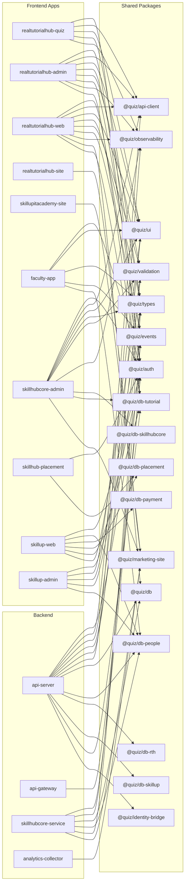
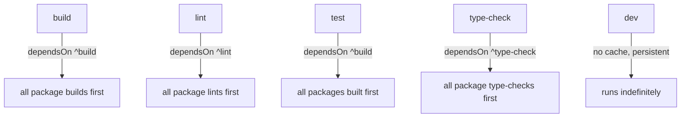

# Quiz Platform — Complete Architecture & Dependency Guide

## 1. Project Identity

| Property | Value |
|---|---|
| **Name** | `quiz-platform` |
| **Type** | Private pnpm monorepo |
| **Node Engine** | `20.x` |
| **Package Manager** | `pnpm@9.15.4` |
| **Monorepo Orchestrator** | Turborepo (`turbo@^2.3.3`) |
| **Language** | TypeScript `^5.7.2` |
| **Primary Framework** | Next.js `16.1.6` |
| **UI Library** | React `19.2.4` + React DOM `19.2.4` |

---

## 2. Monorepo Structure Overview

```mermaid
graph TD
    ROOT["quiz-platform (monorepo root)"]
    ROOT --> APPS["apps/ (11 applications)"]
    ROOT --> PKGS["packages/ (21 shared packages)"]
    ROOT --> SVCS["services/ (3 backend services)"]
    ROOT --> INFRA["infra/ & deploy/"]
    ROOT --> SCRIPTS["scripts/ & tools/"]
    ROOT --> TESTS["tests/, __tests__, e2e/, k6/"]

    APPS --> A1["realtutorialhub-quiz :3001"]
    APPS --> A2["realtutorialhub-admin :3002"]
    APPS --> A3["realtutorialhub-web :3003"]
    APPS --> A4["realtutorialhub-site :3004"]
    APPS --> A5["skillupitacademy-site :3005"]
    APPS --> A6["faculty-app :3006"]
    APPS --> A7["skillhubcore-admin :3007"]
    APPS --> A8["skillhub-placement :3008"]
    APPS --> A9["skillup-web :3009"]
    APPS --> A10["skillup-admin :3010"]
    APPS --> A11["api-server :3000"]

    SVCS --> S1["api-gateway (Hono + Cloudflare)"]
    SVCS --> S2["skillhubcore-service (Hono + Node)"]
    SVCS --> S3["analytics-collector-service (Hono + Node)"]
```



---

## 3. All 11 Applications (apps/)

### 3.1 Frontend Web Apps (Next.js)

| App | Package Name | Port | Purpose |
|---|---|---|---|
| [realtutorialhub-quiz](file:///d:/onlinewebsites/quiz-platform/apps/realtutorialhub-quiz/package.json) | `@quiz/realtutorialhub-quiz` | 3001 | Student-facing quiz/exam platform |
| [realtutorialhub-admin](file:///d:/onlinewebsites/quiz-platform/apps/realtutorialhub-admin/package.json) | `@quiz/realtutorialhub-admin` | 3002 | Admin dashboard for RTH |
| [realtutorialhub-web](file:///d:/onlinewebsites/quiz-platform/apps/realtutorialhub-web/package.json) | `@quiz/realtutorialhub-web` | 3003 | RTH main website (tutorials, content) |
| [realtutorialhub-site](file:///d:/onlinewebsites/quiz-platform/apps/realtutorialhub-site/package.json) | `@quiz/realtutorialhub-site` | 3004 | RTH marketing/landing site |
| [skillupitacademy-site](file:///d:/onlinewebsites/quiz-platform/apps/skillupitacademy-site/package.json) | `@quiz/skillupitacademy-site` | 3005 | SkillUp IT Academy marketing site |
| [faculty-app](file:///d:/onlinewebsites/quiz-platform/apps/faculty-app/package.json) | `@quiz/faculty-app` | 3006 | Faculty management interface |
| [skillhubcore-admin](file:///d:/onlinewebsites/quiz-platform/apps/skillhubcore-admin/package.json) | `@quiz/skillhubcore-admin` | 3007 | SkillHubCore admin panel |
| [skillhub-placement](file:///d:/onlinewebsites/quiz-platform/apps/skillhub-placement/package.json) | `@quiz/skillhub-placement` | 3008 | Placement tracking app |
| [skillup-web](file:///d:/onlinewebsites/quiz-platform/apps/skillup-web/package.json) | `@quiz/skillup-web` | 3009 | SkillUp student web portal |
| [skillup-admin](file:///d:/onlinewebsites/quiz-platform/apps/skillup-admin/package.json) | `@quiz/skillup-admin` | 3010 | SkillUp admin panel |

### 3.2 Backend API (Next.js API Routes)

| App | Package Name | Port | Purpose |
|---|---|---|---|
| [api-server](file:///d:/onlinewebsites/quiz-platform/apps/api-server/package.json) | `@quiz/api-server` | 3000 | Central API server (Next.js API routes) |

---

## 4. All 3 Backend Services (services/)

| Service | Package Name | Framework | Purpose |
|---|---|---|---|
| [api-gateway](file:///d:/onlinewebsites/quiz-platform/services/api-gateway/package.json) | `@quiz/api-gateway` | **Hono** + Cloudflare Workers | Edge API gateway with JWT auth |
| [skillhubcore-service](file:///d:/onlinewebsites/quiz-platform/services/skillhubcore-service/package.json) | `@quiz/skillhubcore-service` | **Hono** + Node.js | Educational hierarchy backend service |
| [analytics-collector-service](file:///d:/onlinewebsites/quiz-platform/services/analytics-collector-service/package.json) | `@quiz/analytics-collector-service` | **Hono** + Node.js | Analytics event collection |

---

## 5. All 21 Shared Packages (packages/)

### 5.1 Database Packages (8 packages)

| Package | Name | ORM | Database | Purpose |
|---|---|---|---|---|
| [db](file:///d:/onlinewebsites/quiz-platform/packages/db/package.json) | `@quiz/db` | Drizzle ORM | Neon PostgreSQL | Core database (quizzes, users, exams) |
| [db-tutorial](file:///d:/onlinewebsites/quiz-platform/packages/db-tutorial) | `@quiz/db-tutorial` | Drizzle ORM | Neon PostgreSQL | Tutorial content database |
| [db-people](file:///d:/onlinewebsites/quiz-platform/packages/db-people) | `@quiz/db-people` | Drizzle ORM | Neon PostgreSQL | People/students/faculty database |
| [db-payment](file:///d:/onlinewebsites/quiz-platform/packages/db-payment) | `@quiz/db-payment` | Drizzle ORM | Neon PostgreSQL | Payment transactions |
| [db-placement](file:///d:/onlinewebsites/quiz-platform/packages/db-placement) | `@quiz/db-placement` | Drizzle ORM | Neon PostgreSQL | Placement records |
| [db-skillhubcore](file:///d:/onlinewebsites/quiz-platform/packages/db-skillhubcore) | `@quiz/db-skillhubcore` | Drizzle ORM | Neon PostgreSQL | Educational hierarchy |
| [db-rth](file:///d:/onlinewebsites/quiz-platform/packages/db-rth) | `@quiz/db-rth` | Drizzle ORM | Neon PostgreSQL | RTH-specific data |
| [db-skillup](file:///d:/onlinewebsites/quiz-platform/packages/db-skillup) | `@quiz/db-skillup` | Drizzle ORM | Neon PostgreSQL | SkillUp-specific data |
| [database](file:///d:/onlinewebsites/quiz-platform/packages/database) | — | — | — | Legacy/shared database utilities |

### 5.2 Core Infrastructure Packages (7 packages)

| Package | Name | Purpose |
|---|---|---|
| [auth](file:///d:/onlinewebsites/quiz-platform/packages/auth/package.json) | `@quiz/auth` | JWT authentication (jose), bcrypt, session management via Upstash Redis |
| [auth-core](file:///d:/onlinewebsites/quiz-platform/packages/auth-core) | `@quiz/auth-core` | Core auth primitives |
| [identity-bridge](file:///d:/onlinewebsites/quiz-platform/packages/identity-bridge) | `@quiz/identity-bridge` | Cross-app identity federation |
| [api-client](file:///d:/onlinewebsites/quiz-platform/packages/api-client) | `@quiz/api-client` | Typed API client for frontend apps |
| [events](file:///d:/onlinewebsites/quiz-platform/packages/events/package.json) | `@quiz/events` | Event system powered by Upstash QStash |
| [observability](file:///d:/onlinewebsites/quiz-platform/packages/observability/package.json) | `@quiz/observability` | Logging & monitoring abstraction |
| [config](file:///d:/onlinewebsites/quiz-platform/packages/config) | `@quiz/config` | Shared environment config & paths |

### 5.3 UI & Shared Utility Packages (6 packages)

| Package | Name | Purpose |
|---|---|---|
| [ui](file:///d:/onlinewebsites/quiz-platform/packages/ui/package.json) | `@quiz/ui` | Shared UI component library (30+ Radix UI primitives, Recharts, DayPicker, etc.) |
| [types](file:///d:/onlinewebsites/quiz-platform/packages/types) | `@quiz/types` | Shared TypeScript type definitions |
| [validation](file:///d:/onlinewebsites/quiz-platform/packages/validation) | `@quiz/validation` | Shared Zod validation schemas |
| [eslint-config](file:///d:/onlinewebsites/quiz-platform/packages/eslint-config) | `@quiz/eslint-config` | Shared ESLint configuration |
| [marketing-site](file:///d:/onlinewebsites/quiz-platform/packages/marketing-site) | `@quiz/marketing-site` | Shared marketing site components/utilities |

---

## 6. Complete Technology Stack

### 6.1 Core Framework & Language

| Technology | Version | Role |
|---|---|---|
| **Next.js** | `16.1.6` | Full-stack React framework (all 11 apps) |
| **React** | `19.2.4` | UI rendering (latest React 19) |
| **TypeScript** | `^5.7.2` | Primary language (strict mode) |
| **Node.js** | `20.x` | Runtime engine |

### 6.2 Database & ORM Layer

| Technology | Version | Role |
|---|---|---|
| **Drizzle ORM** | `^0.45.1` | Type-safe SQL ORM |
| **Drizzle Kit** | `^0.31.8` | Database migrations & schema management |
| **Neon Database** (`@neondatabase/serverless`) | `^0.10.4` | Serverless PostgreSQL (primary database) |
| **pg** | `^8.18.0` | PostgreSQL client (native driver) |

### 6.3 Authentication & Security

| Technology | Version | Role |
|---|---|---|
| **jose** | `^6.1.3` | JWT signing, verification, encryption |
| **jsonwebtoken** | `^9.0.2` | Legacy JWT support |
| **bcryptjs** | `^3.0.3` | Password hashing |
| **bcrypt** | `^6.0.0` | Native password hashing (root) |

### 6.4 Caching, Queuing & Serverless Infrastructure

| Technology | Version | Role |
|---|---|---|
| **Upstash Redis** (`@upstash/redis`) | `^1.36.2` | Session store, caching, rate limiting |
| **Upstash QStash** (`@upstash/qstash`) | `^2.9.1` | Event queue / background job scheduling |
| **Upstash Vector** (`@upstash/vector`) | `^1.2.2` | Vector search (AI/embeddings) |
| **Upstash Workflow** (`@upstash/workflow`) | `^1.1.1` | Durable workflow orchestration |

### 6.5 UI Component Library & Styling

| Technology | Version | Role |
|---|---|---|
| **Radix UI** (20+ primitives) | Various | Accessible, unstyled UI components |
| **TailwindCSS** | `^3.4.1` / `^4` | Utility-first CSS framework |
| **tailwind-merge** | `^2.5.5` / `^3.4.0` | Merge Tailwind class names safely |
| **class-variance-authority (CVA)** | `^0.7.1` | Component variant management |
| **clsx** | `^2.1.1` | Conditional CSS class merging |
| **Framer Motion** / **Motion** | `^12.34.3` / `12.23.24` | Animations & transitions |
| **Lucide React** | `^0.563.0` | Icon library |
| **Recharts** | `^3.7.0` | Charting & data visualization |
| **ECharts** / **echarts-for-react** | `^6.0.0` / `^3.0.6` | Advanced charting |
| **Sonner** | `2.0.7` | Toast notifications |
| **next-themes** | `^0.4.6` | Dark/light mode theming |
| **cmdk** | `^1.1.1` | Command palette (⌘K) |
| **react-day-picker** | `^9.11.1` | Date picker |
| **react-hook-form** | `^7.65.0` | Form state management |
| **embla-carousel-react** | `^8.6.0` | Carousel/slider |
| **vaul** | `^1.1.2` | Drawer/sheet component |
| **react-resizable-panels** | `^3.0.6` | Resizable panel layouts |
| **input-otp** | `^1.4.2` | OTP input component |
| **dompurify** | `^3.3.1` | HTML sanitization |
| **react-icons** | `^5.5.0` | Extended icon set (RTH site) |
| **AOS** | `^2.3.4` | Animate on scroll (RTH site) |
| **Lenis** | `^1.3.17` | Smooth scrolling (RTH site) |
| **tsparticles** | `^3.9.1` | Particle animations (RTH site) |

### 6.6 State Management

| Technology | Version | Role |
|---|---|---|
| **Zustand** | `^5.0.10` | Lightweight global state management |
| **TanStack React Query** | `^5.90.21` | Server state, caching & data fetching |
| **TanStack React Query DevTools** | `^5.91.3` | Dev-time query inspector |

### 6.7 Backend API Framework (Services)

| Technology | Version | Role |
|---|---|---|
| **Hono** | `^4.7.8` | Lightweight, edge-first HTTP framework |
| **@hono/node-server** | `^1.18.1` | Hono adapter for Node.js |
| **Wrangler** | `^4.43.0` | Cloudflare Workers dev/deploy CLI |

### 6.8 File Storage & Media

| Technology | Version | Role |
|---|---|---|
| **AWS S3** (`@aws-sdk/client-s3`) | `^3.995.0` | Object storage |
| **AWS S3 Presigner** | `^3.995.0` | Pre-signed URL generation |
| **Vercel Blob** (`@vercel/blob`) | `^2.3.0` | Blob storage |

### 6.9 Email & Communication

| Technology | Version | Role |
|---|---|---|
| **Resend** | `^6.8.0` | Transactional email delivery |

### 6.10 PDF & Document Generation

| Technology | Version | Role |
|---|---|---|
| **pdf-lib** | `^1.17.1` | PDF generation |
| **Puppeteer Core** | `^24.37.5` | Headless Chrome for PDF/screenshots |
| **@sparticuz/chromium** | `^143.0.4` | Serverless Chromium binary |
| **JSZip** | `^3.10.1` | ZIP file creation |
| **jspdf** | `^3.0.3` | Client-side PDF generation |
| **html-to-image** | `^1.11.11` | HTML → image conversion |
| **QRCode** | `^1.5.4` | QR code generation |

### 6.11 Internationalization

| Technology | Version | Role |
|---|---|---|
| **next-intl** | `^4.8.3` | i18n for Next.js (RTH web) |

### 6.12 Markdown & Content Rendering

| Technology | Version | Role |
|---|---|---|
| **react-markdown** | `^10.1.0` | Markdown rendering |
| **remark-gfm** | `^4.0.1` | GitHub Flavored Markdown support |

### 6.13 Validation

| Technology | Version | Role |
|---|---|---|
| **Zod** | `^3.24.1` | Schema validation (shared across all apps) |

### 6.14 Logging & Observability

| Technology | Version | Role |
|---|---|---|
| **Pino** | `^10.3.1` | Structured JSON logging |
| **pino-http** | `^11.0.0` | HTTP request logging middleware |
| **pino-pretty** | `^13.1.3` | Pretty-print logs in dev |
| **Sentry** (`@sentry/nextjs`) | `^10.40.0` | Error tracking & performance monitoring |
| **Vercel Analytics** | `^1.6.1` | Web analytics |
| **OpenTelemetry** (`@opentelemetry/api`) | `^1.9.0` | Distributed tracing |

### 6.15 PWA Support

| Technology | Version | Role |
|---|---|---|
| **Serwist** (`@serwist/next`) | `^9.5.7` | Service worker / PWA support |

### 6.16 Caching

| Technology | Version | Role |
|---|---|---|
| **lru-cache** | `^11.2.5` | In-memory LRU cache |
| **cookie** | `^1.0.2` | Cookie parsing/serialization |

### 6.17 Date Utilities

| Technology | Version | Role |
|---|---|---|
| **date-fns** | `4.1.0` | Date manipulation & formatting |

---

## 7. Development & Build Toolchain

### 7.1 Build & Task Orchestration

| Tool | Version | Role |
|---|---|---|
| **Turborepo** | `^2.3.3` | Monorepo task runner with caching |
| **pnpm** | `9.15.4` | Package manager (workspaces) |
| **cross-env** | `^10.1.0` | Cross-platform env variables |
| **tsx** | `^4.19.1` | TypeScript execution (scripts) |
| **ts-node** | `^10.9.2` | TypeScript execution (legacy) |
| **ts-morph** | `^27.0.2` | TypeScript AST manipulation |
| **PostCSS** | `^8` | CSS post-processing |
| **Autoprefixer** | `^10.4.23` | CSS vendor prefixing |
| **@next/bundle-analyzer** | `^16.1.6` | Next.js bundle size analysis |

### 7.2 Linting & Code Quality

| Tool | Version | Role |
|---|---|---|
| **ESLint** | `^8.57.0` / `^9` | JavaScript/TypeScript linting |
| **eslint-config-next** | `15.2.0` / `16.1.6` | Next.js-specific ESLint rules |
| **@typescript-eslint** | `8.57.0` | TypeScript ESLint parser & rules |
| **eslint-plugin-jsx-a11y** | `^6.10.2` | Accessibility linting |
| **eslint-plugin-security** | `^3.0.1` | Security vulnerability linting |
| **eslint-plugin-simple-import-sort** | `^12.1.1` | Import ordering |
| **eslint-plugin-react-hooks** | `4.6.2` | React Hooks rules |
| **Husky** | `^9.1.7` | Git hooks |
| **lint-staged** | `^16.2.7` | Run linters on staged files |

### 7.3 Testing Stack

| Tool | Version | Role |
|---|---|---|
| **Vitest** | `^4.0.18` | Unit/integration test runner |
| **@vitest/ui** | `^4.0.18` | Vitest browser UI |
| **@vitest/coverage-v8** | `^4.0.18` | Code coverage (V8) |
| **@testing-library/react** | `^16.3.2` | React component testing |
| **@testing-library/jest-dom** | `^6.9.1` | DOM assertions |
| **@testing-library/dom** | `^10.4.1` | DOM testing utilities |
| **@testing-library/user-event** | `^14.6.1` | User interaction simulation |
| **jsdom** | `^28.1.0` | DOM environment for testing |
| **Playwright** | `^1.59.1` | E2E browser testing |
| **@axe-core/playwright** | `^4.11.1` | Accessibility E2E testing |
| **k6** | — | Load/performance testing |
| **Lighthouse CI** (`@lhci/cli`) | `^0.14.0` | Performance auditing |
| **@vitejs/plugin-react** | `^5.1.4` | Vite React support for tests |
| **vite-tsconfig-paths** | `^6.1.1` | TypeScript path aliases in Vite |

---

## 8. Deployment & Infrastructure

### 8.1 Cloud & Hosting

| Platform | Usage |
|---|---|
| **Google Cloud Run** | Container deployment for sites (RTH-site, SUIA-site, etc.) |
| **Google Cloud Build** | CI/CD pipeline (Docker build → Artifact Registry → Cloud Run) |
| **Google Artifact Registry** | Docker image storage (`asia-south1`) |
| **Cloudflare Workers** | API Gateway edge deployment |
| **Vercel** | Likely used for some Next.js app deployments |
| **Hostinger** | Additional hosting infrastructure |

### 8.2 Cloud Build Pipelines

| Pipeline | Target |
|---|---|
| [cloudbuild.realtutorialhub-site.yaml](file:///d:/onlinewebsites/quiz-platform/cloudbuild.realtutorialhub-site.yaml) | RTH marketing site → Cloud Run |
| [cloudbuild.skillupitacademy-site.yaml](file:///d:/onlinewebsites/quiz-platform/cloudbuild.skillupitacademy-site.yaml) | SUIA marketing site → Cloud Run |
| [cloudbuild.analytics-collector-service.yaml](file:///d:/onlinewebsites/quiz-platform/cloudbuild.analytics-collector-service.yaml) | Analytics service → Cloud Run |
| [cloudbuild.skillhub-placement.yaml](file:///d:/onlinewebsites/quiz-platform/cloudbuild.skillhub-placement.yaml) | Placement app → Cloud Run |

---

## 9. Internal Package Dependency Graph



---

## 10. Key Vendor Categories Summary

### By Count of Unique 3rd-Party Vendors Used

| Category | Count | Key Vendors |
|---|---|---|
| **UI Components** | 25+ | Radix UI (20 primitives), Recharts, ECharts, Framer Motion, Sonner, cmdk, vaul |
| **Database** | 3 | Neon PostgreSQL, Drizzle ORM, pg |
| **Serverless Infra** | 4 | Upstash (Redis, QStash, Vector, Workflow) |
| **Auth/Security** | 3 | jose, bcryptjs, jsonwebtoken |
| **Cloud Platform** | 3 | Google Cloud (Run, Build, Artifact Registry), Cloudflare Workers, Vercel |
| **Monitoring** | 3 | Sentry, Vercel Analytics, OpenTelemetry |
| **Testing** | 6 | Vitest, Playwright, Testing Library, k6, Lighthouse CI, axe-core |
| **Build Tools** | 5 | Turborepo, pnpm, PostCSS, Autoprefixer, ESLint |
| **Document Gen** | 5 | pdf-lib, Puppeteer, JSZip, jspdf, html-to-image |

---

## 11. Architecture Patterns

> [!IMPORTANT]
> ### Key Design Decisions
> - **Multi-database strategy**: 8 separate Drizzle schema packages for domain isolation (quiz, tutorial, people, payment, placement, skillhubcore, rth, skillup)
> - **Edge-first gateway**: API Gateway runs on Cloudflare Workers using Hono for low-latency routing
> - **Shared UI library**: `@quiz/ui` wraps 20+ Radix primitives into a consistent design system
> - **Event-driven architecture**: Upstash QStash handles async background jobs across services
> - **Serverless PostgreSQL**: Neon Database provides auto-scaling, connection pooling, and branching

### Architectural Style
- **Monorepo** with clear domain boundaries via workspace packages
- **Micro-frontend-ish**: 11 separate Next.js apps, each deployable independently
- **API-first**: Central `api-server` with typed `api-client` consumed by frontends
- **Edge + Origin**: Cloudflare Workers gateway → Cloud Run / Vercel origin servers

### Authentication Flow
```
Client → api-gateway (Cloudflare) → JWT verify (jose) → api-server (Next.js)
                                                          ↓
                                              @quiz/auth → Upstash Redis sessions
                                                          ↓
                                              @quiz/identity-bridge → Cross-app SSO
```

### Data Flow
```
Frontend App → @quiz/api-client → api-server (Next.js API Routes)
                                       ↓
                               @quiz/db-* (Drizzle ORM)
                                       ↓
                               Neon PostgreSQL (Serverless)
```

---

## 12. Port Map (Local Dev)

| Port | Application |
|---|---|
| 3000 | api-server |
| 3001 | realtutorialhub-quiz |
| 3002 | realtutorialhub-admin |
| 3003 | realtutorialhub-web |
| 3004 | realtutorialhub-site |
| 3005 | skillupitacademy-site |
| 3006 | faculty-app |
| 3007 | skillhubcore-admin |
| 3008 | skillhub-placement |
| 3009 | skillup-web |
| 3010 | skillup-admin |

---

## 13. Turborepo Task Pipeline



Build outputs: `.next/**`, `next-env.d.ts`, `dist/**`
