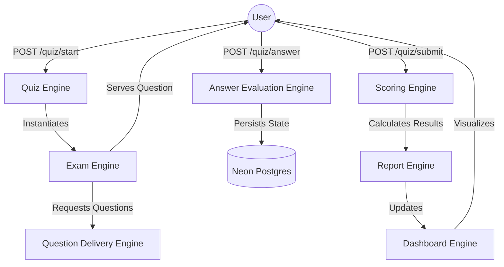
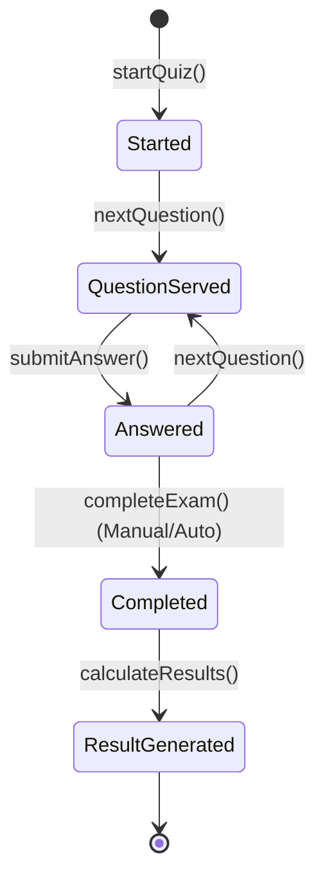

# Runtime Engine Architecture

## Overview
The Runtime Engine Layer orchestrates the live behavior of the platform, managing the transition from static content models to interactive user sessions.

## Runtime Flow Diagram

## Session Lifecycle Diagram

## Internal Engines
- **Quiz Engine**: Lifecycle & State management.
- **Exam Engine**: Session timing & submission flow.
- **Question Delivery**: Streaming & Randomization.
- **Answer Evaluation**: Content-aware correctness check.
- **Scoring Engine**: Multi-dimensional point calculation.
- **Report Engine**: Mastery & Progress analysis.
- **Admin Engine**: Publishing & Approval workflows.
