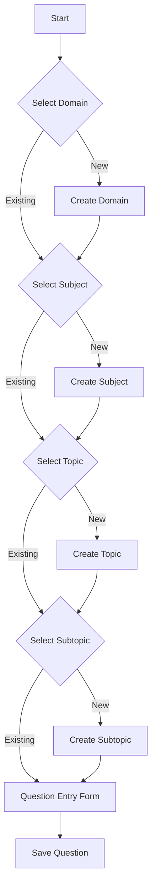

# Admin Dashboard Specification
## Quiz Platform – Enterprise Control Panel

> [!NOTE]
> **Purpose**: This document defines **what must be visible on the Admin Dashboard**, why it is visible, and how it supports platform health, security, and quality.  
> This is a **product + execution document**, written in simple language for clarity and alignment across engineering, QA, and stakeholders.

---

## 1. Overview

The **Admin Dashboard** is the **control center** of the platform.

Admins do NOT:
- Take exams
- Answer questions
- Manage UI design

Admins DO:
- Monitor platform health
- Ensure security
- Maintain content quality
- Verify exam and scoring integrity

This dashboard answers one core question:

> “Is the platform secure, healthy, and delivering quality assessments?”

---

## 2. User & Account Overview

### What Should Be Visible

- Total registered users
- New users today / this week / this month
- Email verified vs unverified users
- Recently active users
- Locked or suspended accounts (if applicable)

### Why This Exists

- Track platform growth
- Detect suspicious or fake accounts
- Ensure users are completing email verification
- Support basic user management

---

## 3. Roles & Permissions (RBAC)

### What Should Be Visible

- List of available roles:
  - User
  - Admin
  - Super Admin
- Number of users assigned to each role
- Role assignment history

### Why This Exists

- Prevents accidental privilege escalation
- Ensures admins know who has elevated access
- Supports enterprise governance

---

## 4. Security & Login Health

### What Should Be Visible

- Successful vs failed login attempts (aggregated)
- Accounts with repeated failed logins
- Active sessions count (real-time)
- Recent authentication activity
- Suspicious activity indicators (Threat Levels)

### Why This Exists

- Detect brute-force or abuse attempts
- Monitor platform security health
- Provide early warning signals

---

## 5. Domain & Content Structure Overview

### What Should Be Visible

- List of Domains (e.g., Full Stack, Data Science)
- Subjects under each domain
- Topics under each subject
- Topic complexity level & weights
- Active vs inactive status

### Why This Exists

- Ensures syllabus completeness
- Helps admins validate curriculum structure

---

## 6. Question Bank Health

### What Should Be Visible

- Total questions per domain/subject/topic
- Difficulty distribution:
  - Simple (Target: 30%)
  - Intermediate (Target: 30%)
  - Expert (Target: 40%)
- Active vs inactive questions
- Topics with insufficient questions (Critical Alerts)

### Tabular Data View (Hierarchy Management)

To ensure full visibility, the Admin Dashboard must expose raw data tables for each layer of the hierarchy:

#### 1. Domains Table (Level 1)
- **Columns**: Name, Category, Description, Status, Created At.
- **Actions**: Edit, Archive.

#### 2. Subjects Table (Level 2)
- **Columns**: Name, Parent Domain, Order, Status.
- **Actions**: Edit, Reorder.

#### 3. Topics Table (Level 3)
- **Columns**: Name, Parent Subject, Complexity (1-10), Weight, Status.
- **Actions**: Edit, Validate Readiness.

#### 4. Subtopics Table (Level 4)
- **Columns**: Name, Parent Topic, Depth Level.
- **Actions**: Edit.

#### 5. Questions Table (Level 5)
- **Columns**: Text (Truncated), Topic/Subtopic, Type, Difficulty, Status.
- **Actions**: View, Edit.

#### 6. Skills Table (Metadata)
- **Columns**: Name, Category, Mapping Type (Conceptual/Technical).
- **Actions**: Edit, Merge.

### Why This Exists

- Maintains fair difficulty balance
- Ensures enterprise exam standards are met

---

## 7. Exam Blueprint Monitoring

### What Should Be Visible

- Total blueprints generated
- Blueprint scope (Domain/Subject/Topic)
- Question count & Difficulty distribution
- Blueprint generation success / failure logs

### Why This Exists

- Confirms enterprise exam rules are enforced
- Allows auditing of exam configuration

---

## 8. Exam Activity Overview

### What Should Be Visible

- Total exams started
- Exams completed vs abandoned
- Exams per domain
- Average completion time

### Why This Exists

- Understand user engagement
- Identify UX or timing issues

---

## 9. Scoring & Performance Analytics (Aggregated)

### What Should Be Visible

- Average scores by domain
- Average scores by difficulty
- Pass / fail trends
- Topics with lowest accuracy (Gap Analysis)

### Why This Exists

- Measure exam quality
- Detect overly easy or hard topics

---

## 10. Audit & System Logs

### What Should Be Visible

- User creation events
- Role changes
- Exam blueprint generation events
- System-level warnings or errors

### Why This Exists

- Compliance
- Debugging
- Enterprise trust and traceability

---

## 11. Restriction Matrix

| Restricted Item | Reason |
|-----------------|--------|
| Passwords | High Security Risk |
| User Secrets / Tokens | High Security Risk |
| Individual Answer Data | Privacy compliance |

---

## 12. Final Goal

This Admin Dashboard provides **Confidence through Clarity**. It transforms raw database records into **Actionable Governance Signals**.

---

## 13. Question Entry Workflow Design

### Overview
This section outlines the design for a comprehensive, hierarchical data entry form for adding questions to the Question Bank. The flow ensures referential integrity by guiding the user through the Domain > Subject > Topic > Subtopic hierarchy before creating a question.

### Workflow



### Detailed Steps

#### Step 1: Domain Selection
- **Input**: Combobox / Autocomplete.
- **Data Source**: `GET /api/admin/domains`
- **Action**: User selects a domain.
- **Edge Case**: Domain not found.
    - **UI**: "Add new Domain" button triggers a modal or inline form.
    - **Fields**: Name, Description, Category.
    - **API**: `POST /api/admin/domains`

#### Step 2: Subject Selection
- **Condition**: Enabled only after Domain is selected.
- **Input**: Combobox.
- **Data Source**: `GET /api/admin/subjects?domainId={selectedId}`
- **Action**: User selects a subject.
- **Edge Case**: Subject not found.
    - **UI**: "Add new Subject" button.
    - **Fields**: Name, Description.
    - **API**: `POST /api/admin/subjects` (Payload includes `domainId`)

#### Step 3: Topic Selection
- **Condition**: Enabled only after Subject is selected.
- **Input**: Combobox.
- **Data Source**: `GET /api/admin/topics?subjectId={selectedId}`
- **Action**: User selects a topic.
- **Edge Case**: Topic not found.
    - **UI**: "Add new Topic" button.
    - **Fields**: Name, Complexity Level.
    - **API**: `POST /api/admin/topics` (Payload includes `subjectId`)

#### Step 4: Subtopic (Skill) Selection
- **Condition**: Enabled only after Topic is selected.
- **Input**: Combobox.
- **Data Source**: `GET /api/admin/subtopics?topicId={selectedId}`
- **Action**: User selects a subtopic (skill).
- **Edge Case**: Subtopic not found.
    - **UI**: "Add new Subtopic" button.
    - **Fields**: Name, Description.
    - **API**: `POST /api/admin/subtopics` (Payload includes `topicId`)

#### Step 5: Question Entry
- **Condition**: Enabled after Subtopic is selected.
- **Components**:
    - **Question Text**: Rich Text Editor (Markdown support).
    - **Question Type**: Single Choice / Multiple Choice.
    - **Options**: Dynamic list of options with "Is Correct" toggle.
    - **Explanation**: Rich text for answer explanation.
    - **Metadata**: Difficulty (1-5), Estimated Time.
    - **Tags**: Multi-select.
- **API**: `POST /api/admin/questions`

### UI/UX Refinements (Phase 7.1)
- **Visual Theme**: Move away from "back and grey" monochrome. Use the project's primary colors (Pinks/Purples/Glassmorphism) to feel "Premium" and "Alive".
- **Feedback**: Immediate, obvious confirmation upon successful creation (Toast/Banner that doesn't disappear too fast).
- **Layout**: Ensure the form feels integrated, not isolated.


### Technical Implementation

#### State Management
Use a unified form state object:
```typescript
interface QuestionEntryState {
  domainId: string | null;
  subjectId: string | null;
  topicId: string | null;
  subtopicId: string | null;
  question: QuestionFormData;
}
```

#### Components
- `CascadingSelect`: A reusable component for the Domain/Subject/Topic/Subtopic selectors that handles fetching and the "Add New" flow.
- `QuestionForm`: The final form for the question data.
- `QuestionEditor`: The rich editor component for assessment content.
- `QuestionEntryWizard`: The container component managing the overall state.

---

## 14. Phase 8: Question Bank Management (Console)

### Overview
Transforms the Question List into a full management console, enabling admins to filter, search, edit, and safely delete existing content.

### Features

#### 1. Advanced Hierarchical Filtering
- **UI**: Embed `CascadingSelect` at the top of the `QuestionTable`.
- **Logic**: Selecting a Domain/Subject/Topic/Subtopic dynamically filters the questions displayed in the table.
- **Goal**: Allow admins to quickly find questions within specific syllabus areas.

#### 2. Content Editing Flow
- **Workflow**:
    1. Admin clicks **Edit** on a question row.
    2. System navigates to `/questions/[id]/edit`.
    3. `QuestionEditor` is pre-populated with existing data.
    4. Admin saves changes -> `PATCH` request updates the record.
- **Referential Integrity**: Edits must maintain correct links to the hierarchy.

#### 3. Enterprise Deletion Governance
- **Requirement**: Hard-deleting questions can break historical exam results.
- **Implementation**: **Soft Delete**.
- **Action**: Dashboard marks question as `status: 'inactive'`.
- **UI**: Row is removed from the active list but remains in the database for audit and analytics integrity.
- **Safety**: Confirmation dialog required for all deletion attempts.

#### 4. Real-Time Metrics Update
- **Requirement**: Saving or deleting questions should reflect in the dashboard counts and topic-readiness alerts immediately or upon next refersh.

---
