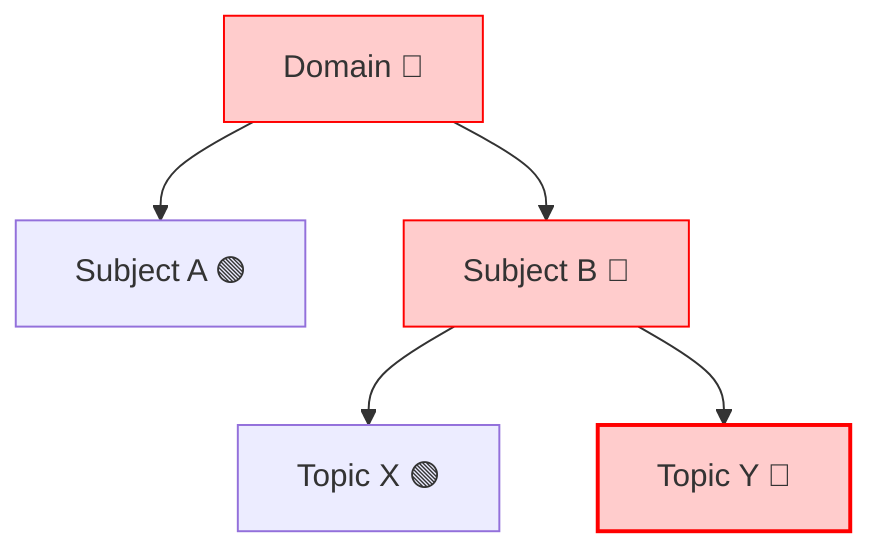

# Atomic Factory Refinement: Smart Context & Strategic Healing

## Goal
To transform the "Heal" workflow from a generic data entry task into a context-aware surgical repair tool. The system will intelligently pre-fill known hierarchy data and strictly position entry points (edit icons) at the precise level causing blocking issues.

---

## 1. Smart Context Seeding (The "Skeleton" Strategy)
When a user clicks "Heal" (⚡) on a node, the JSON payload must be pre-constructed based on the node's lineage.

### Logic Matrix
| User Clicks On | Pre-Filled JSON Context | Cursor Focus / Task |
| :--- | :--- | :--- |
| **Domain** | `{ "domain": "Web Dev", "subjects": [ ... ] }` | User asked to add missing **Subjects**. |
| **Subject** | `{ "domain": "Web Dev", "subjects": [{ "name": "React", "topics": [ ... ] }] }` | User asked to add missing **Topics**. |
| **Topic** | `{ "domain": "Web Dev", "subjects": [{ "name": "React", "topics": [{ "name": "Hooks", "questions": [ ... ] }] }] }` | User asked to add missing **Subtopics** or **Questions**. |

### Template Behavior
- **Never Overwrite**: The `Generate Template` button must merge with existing keys, not replace them.
- **Smart Stubs**: If a Topic is selected, automatically append a `questions: [ { difficulty: 'simple', ... } ]` stub, as that is the most likely missing data.

---

## 2. "Blocking Child" Healing Icon Strategy
The "Heal" (⚡/🪄) icon should not indiscriminately appear on every red node. It should appear **closest to the problem** to encourage granular fixing.

### The Rule: "Deepest Fault Priority"
1.  **If a Topic is 🔴**: Show the Heal icon on the **Topic**.
    *   *Rationale*: This is the actual layer missing questions. Fix it here.
2.  **If a Subject is 🔴 but all its Topics are 🟢 (Empty Subject)**: Show Heal icon on the **Subject**.
    *   *Rationale*: The subject has no topics. The user needs to add topics.
3.  **If a Domain is 🔴 but all Subjects are 🟢 (Empty Domain)**: Show Heal icon on the **Domain**.

### Visual Logic

*   **Topic Y**: Shows ⚡ (Primary Fix Location). This is where the questions are missing.
*   **Subject B**: Shows status "POOR_POOL" but **NO** heal button (or a muted one), because the actionable fix is deeper.
*   **Domain**: Shows status "ACTION REQUIRED" but **NO** heal button.

**Exception**: If a node is collapsed, the parent *must* indicate that a child needs healing, perhaps with a different icon style (e.g., "Expand to Fix").

---

## 3. Implementation Plan

### A. Frontend (`ContentReadinessBoard.tsx`)
- Refactor `openHealWizard` to accept a `mode` (append vs create).
- Update the recursion logic to only render the `<Zap />` button if the node is the **Deepest Red Node** in the visible path.

### B. Wizard (`HierarchyFactoryWizard.tsx`)
- Update `useEffect` to construct the `payload` using `initialData` + `smartStub`.
- Ensure `ENTER_DOMAIN_NAME` placeholders are replaced with actual `props.initialData` values.

### C. Validation
- Verify "Start Enterprise Exam" is unblocked only when the specific child causing the block is healed.
